# Лабараторная работа. Базовая настройка коммутатора
### Топология
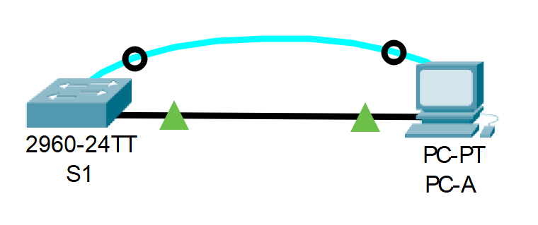

### Таблица адресации
| Устройство | Интерфейс | IP-адрес/префикс |
|------------|-----------|------------------|
| S1         | VLAN 1    | 192.168.1.2/24   |
| PC-A       | NIC       | 192.168.1.10/24  |

### Задачи:
**Часть 1. Проверка конфигурации коммутатора по умолчанию**

**Часть 2. Создание сети и настройка основных параметров устройства**
* Настройте базовые параметры коммутатора.
* Настройте IP-адрес для ПК.

**Часть 3. Проверка сетевых подключений**
* Отобразите конфигурацию устройства.
* Протестируйте сквозное соединение, отправив эхо-запрос.
* Протестируйте возможности удаленного управления с помощью Telnet.

### Решение:
[Часть 1. Создание сети и проверка настроек коммутатора по умолчанию](#часть-1-создание-сети-и-проверка-настроек-коммутатора-по-умолчанию)
* [Шаг 1. Создание сети согласно топологии](#шаг-1-создание-сети-согласно-топологии)
* [Шаг 2. Проверка настроек коммутатора по умолчанию](#шаг-2-проверка-настроек-коммутатора-по-умолчанию)

[Часть 2. Настройка базовых параметров сетевых устройств](#часть-2-настройка-базовых-параметров-сетевых-устройств)
* [Шаг 1. Настройка базовых параметров коммутатора](#шаг-1-настройка-базовых-параметров-коммутатора)
* [Шаг 2. Настройка IP-адреса на компьютере PC-a](#шаг-2-настройка-ip-адреса-на-компьютере-pc-a)

[Часть 3. Проверка сетевых подключений](#часть-3-проверка-сетевых-подключений)
* [Шаг 1. Отображение конфигурации коммутатора](#шаг-1-отображение-конфигурации-коммутатора)
* [Шаг 2. Тест сквозного соединения](#шаг-2-тест-сквозного-соединения)
* [Шаг 3. Проверка удаленного управления](#шаг-3-проверка-удаленного-управления)

[Вопросы для повторения](#вопросы-для-повторения)

[Приложение A. Инициализация и перезагрузка коммутатора](#приложение-a-инициализация-и-перезагрузка-коммутатора)

  
### Часть 1. Создание сети и проверка настроек коммутатора по умолчанию

#### Шаг 1. Создание сети согласно топологии.
a. Добавим в рабочую область Cisco Packet Tracer 1 коммутатор Cisco 2960 (S1) и 1 ПК (PC-A) и соединим их консольным кабелем

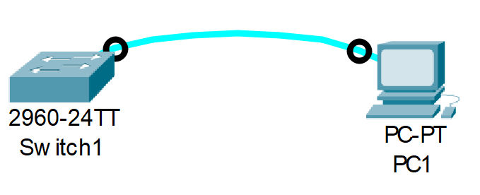

b. Установим консольное подключение к коммутатору. Консольное подключение позволяет получить доступ к командному интерфейсу коммутатора для первоначальной конфигурации устройства, так как сетевые параметры (ip-адрес, маска подсети, шлюз по умолчанию) и параметры для удаленного доступа через Telnet или SSH еще не настроены

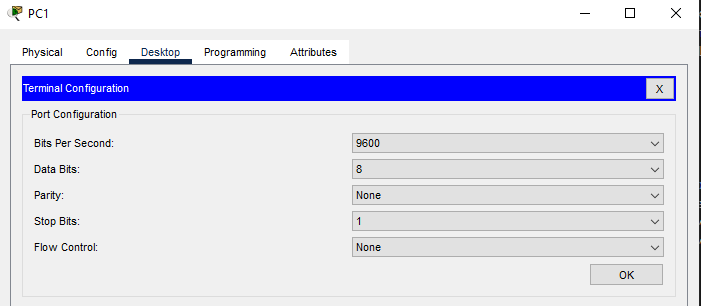

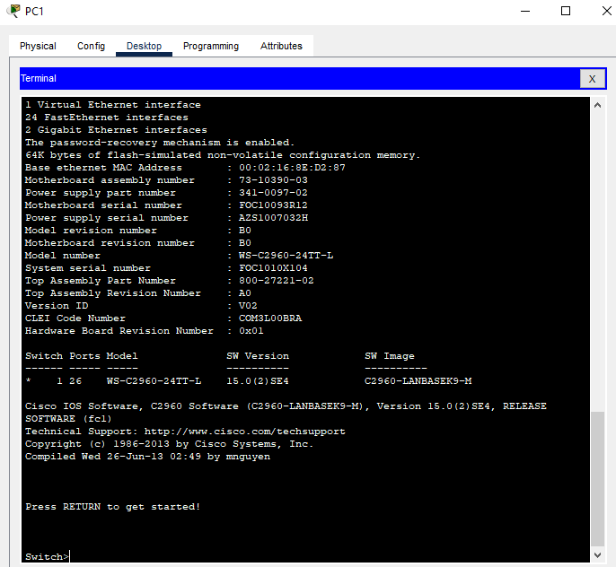

#### Шаг 2. Проверка настроек коммутатора по умолчанию.
a. Войдем в привилегированный режим EXEC с помощью команды `enable` и убедимся, что на коммутаторе находится файл конфигурации по умолчанию, с помощью команды `show running-config`

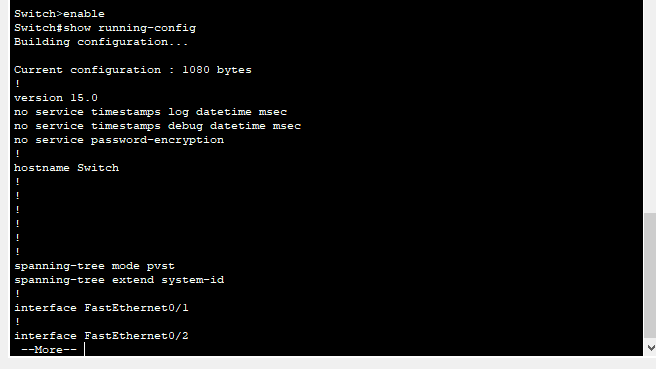

b. Изучим текущую конфигурацию. Из конфигурации видно, что на коммутаторе Cisco 2960 имеется 24 интерфейса FastEthernet (FastEthernet0/1 - FastEthernet0/24) и 2 интерфейса GigabitEthernet (GigabitEthernet0/1 и GigabitEthernet0/2). Также есть 2 vty-линии с диапазонами значений 0-4 и 5-15

c. Изучим файл загрузочной конфигурации. Введем команду `show startup-config` и увидим сообщение `startup-config is not present`. Это означает, что коммутатор сброшен к заводским настройкам. В нашем случае коммутатор настраивается впервые и запись конфига в энергонезависимую память еще не делалась.

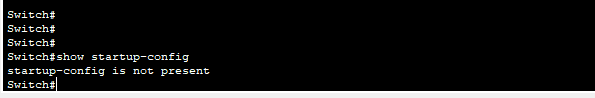

d. Изучим характеристики SVI (Switched Virtual Interface) для VLAN 1. Введем команду `show interface vlan1` и увидим, что ip-адрес не назначен. MAC-адрес 0002.168e.d287. Также при вводе команды `show interface vlan1` мы увидим сообщение `Vlan1 is administratively down, line protocol is down`, это означает, что интерфейс VLAN 1 выключен

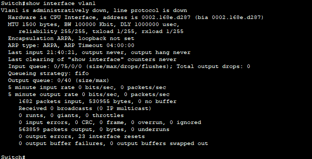

e. Изучим IP-свойства интерфейса SVI для VLAN 1. Для этого введем команду `show ip interface vlan1` и увидим сообщение `Vlan1 is administratively down, line protocol is down. Internet protocol processing disabled`.

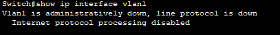

f. Подключим компьютер PC-A к 6 порту коммутатора и снова посмотрим IP-свойства интерфейса SVI сети VLAN 1. Опять введем команду `show ip interface vlan1` и увидим сообщение `Vlan1 is administratively down, line protocol is down. Internet protocol processing disabled`.

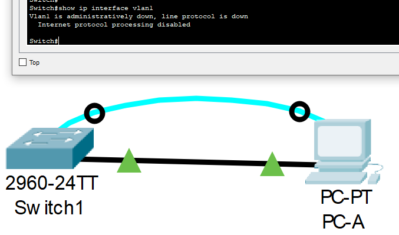

g. Изучим сведения о версии ОС Cisco IOS на коммутаторе. Для этого введем команду `show version`. Из вывода команды видно, что коммутатор работает под управлением версии 15.0(2)SE4. Файл образа системы называется "c2960-lanbasek9-mz.150-2.SE4.bin"

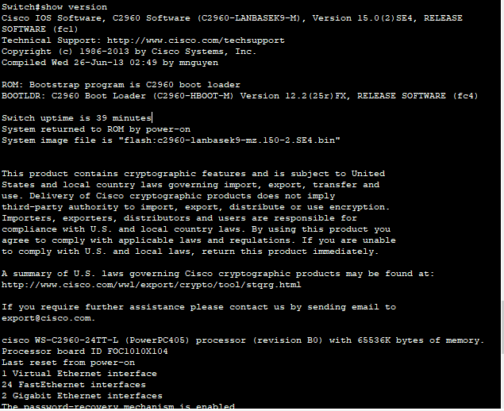

h. Изучим свойства по умолчанию интерфейса FastEhtern0/6, который используется компьютером PC-A. Введем команду `show interface f0/6`. Видим, что интерфейс включен. Для включения интерфейса необходимо подключить компьютер или любое другое устройство. MAC-адрес интерфейса 0090.0c57.6c06. Настройки дуплекса и скорости - Full-duplex, 100Mb/s

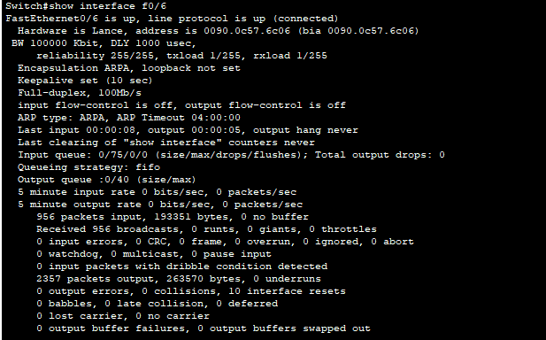

i. Введем команду `show flash`, чтобы изучть флеш-память коммутатора. Образу Cisco IOS присвоено имя c2960-lanbasek9-mz.150-2.SE4

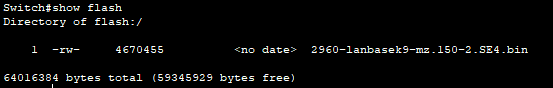

### Часть 2. Настройка базовых параметров сетевых устройств

#### Шаг 1. Настройка базовых параметров коммутатора
a. Войдем в режим глобальной конфигурации с помощью команды `configure terminal` и поочередно введем следующие команды:
* `no ip domain-lookup`
* `hostname S1`
* `service password-encryption`
* `enable secret class`
* `banner motd #`
* `Unauthorized access is strictly prohibited. #`

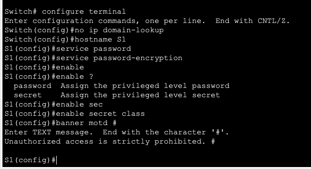

b. Назначим IP-адрес интерфейсу SVI на коммутаторе. Для этого с помощью команды `interface vlan1` перейдем в режим настройки интерфейса и командой `ip address 192.168.1.2 255.255.255.0` назначим ip-адрес в соответствии с таблицей адресации

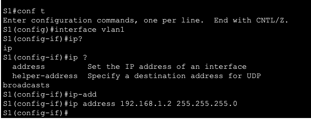

c. Ограничим доступ через консольный порт

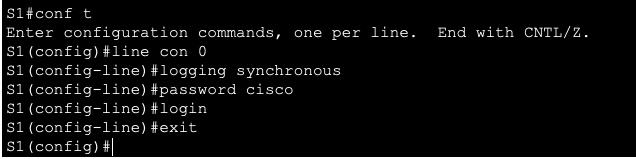

d. Настроим доступ через telnet

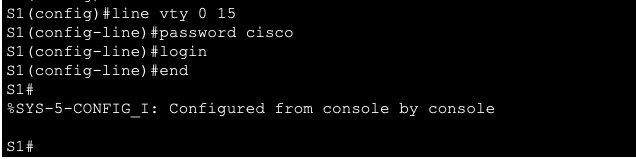

Команда `login` нужна включения входа по паролю. Без нее пароль будет задан, но не будет использоваться при попытке входа

#### Шаг 2. Настройка IP-адреса на компьютере PC-a
В соответствии с таблицей адресации зададим IP-адрес 192.168.1.10 и маску 255.255.255.0

### Часть 3. Проверка сетевых подключений
#### Шаг 1. Отображение конфигурации коммутатора
a. С помощью команды `show run` отобразим текущую конфигурацию

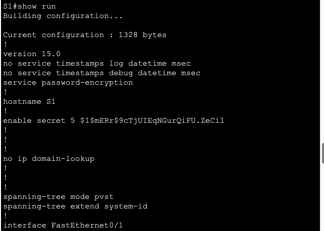

b. С помощью команды `show interface vlan 1` посмотрим параметры VLAN 1

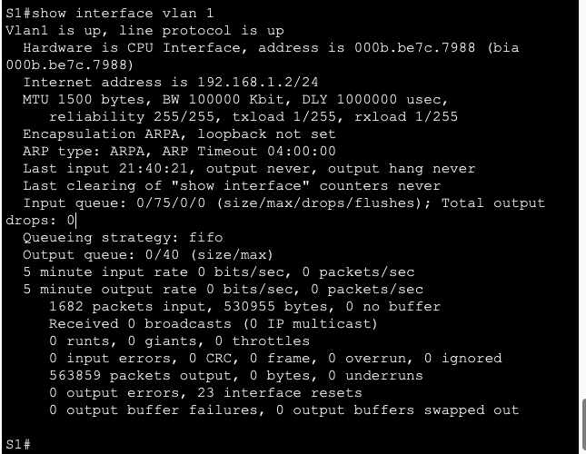

Полоса пропускания 100000 Kbit (100 Мегабит)

#### Шаг 2. Тест сквозного соединения
a. Проверим доступность компьютера PC-A

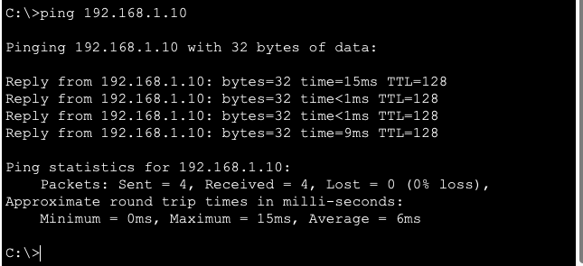

b. Проверим доступность коммутатора, отправив эхо-запрос на адрес интерфейса SVI коммутатора S1

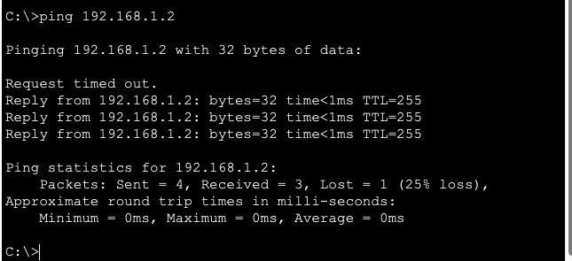

#### Шаг 3. Проверка удаленного управления
Для проверки подключения через telnet в командной строке компьютера PC-A введем команду `telnet 192.168.1.2` 

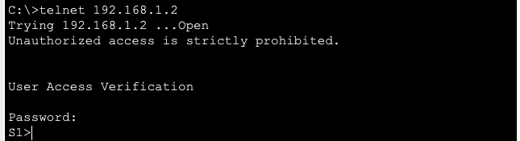

### Вопросы для повторения
1. Пароль VTY настраивается, чтобы можно было обращаться к коммутатору по протоколу Telnet
2. использовать команду глобальной конфигурации `service password-encryption`

### Приложение A. Инициализация и перезагрузка коммутатора
a. Сохраним настройки командой `copy running-config startup-config`

b. Воспользуемся командой `show flash`, чтобы определить были ли созданы сети VLAN. Это можно понять если во флеш-памяти будет файл vlan.dat

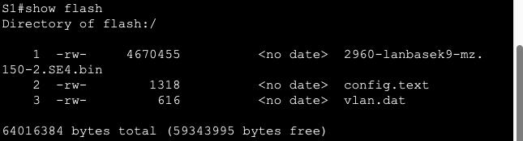

c. С помощью команды `delete vlan.dat` удалим файл

d. Подтвердим удаление

e. Удалим файл загрузочной конфигурации командой `erase startup-config`

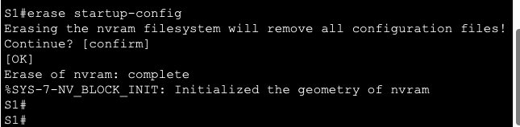

f. Перезагрузим коммутатор командой `reload`
