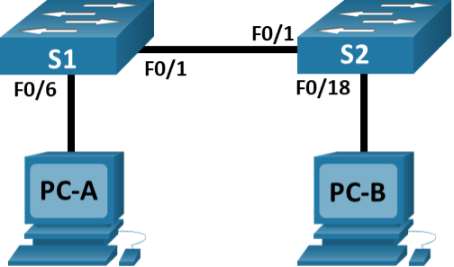

# Лабораторная работа. Просмотр таблицы MAC-адресов коммутатора
### Топология

### Таблица адресации
| Устройство | Интерфейс | IP-адрес         | Маска подсети     |
|------------|-----------|------------------|-------------------|
| S1         | VLAN 1    | 192.168.1.11     | 255.255.255.0     |
| S2         | VLAN 1    | 192.168.1.12     | 255.255.255.0     |
| PC-A       | NIC       | 192.168.1.1      | 255.255.255.0     |
| PC-B       | NIC       | 192.168.1.2      | 255.255.255.0     |

### Решение

#### Часть 1. Часть 1. Создание и настройка сети

##### Шаг 1. Подключил сеть в соответствии с топологией

##### Шаг 2. Настроил узлы ПК

##### Шаг 3. Выполнил инициализацию и перезагрузку коммутаторов

##### Шаг 4. Настроил базовые параметры каждого коммутатора

a. Настроил имена устройств в соответствии с топологией.

b. Настроил IP-адреса, как указано в таблице адресации.

c. Назначил cisco в качестве паролей консоли и VTY

d. Назначил class в качестве пароля доступа к привилегированному режиму EXEC.

Настройку коммутаторов выполнял подсоединив консольный кабель с помощью приложения Terminal.

#### Часть 2. Изучение таблицы МАС-адресов коммутатора

##### Шаг 1. Запишем МАС-адреса сетевых устройств

a. С помощью командной строки на **PC-A** и **PC-B** и команды ipconfig /all изучил свойства сетевых интерфейсов PC.

Физические адреса адаптеров Ethernet:

- MAC-адрес компьютера PC-A: **00-0D-BD-DD-B8-BB**
- MAC-адрес компьютера PC-B: **00-D0-BC-86-58-75**

b. Подключился к коммутаторам S1 и S2 через **Telnet** и ввел команду **show interface F0/1** на каждом коммутаторе.

Адреса оборудования (или зашитый адрес — bia):

- МАС-адрес коммутатора S1 Fast Ethernet 0/1: **0090.2b44.6d01 (bia 0090.2b44.6d01)**
- МАС-адрес коммутатора S2 Fast Ethernet 0/1: **0090.21dc.b701 (bia 0090.21dc.b701)**

##### Шаг 2. Изучим таблицу МАС-адресов коммутатора

Подключимся к коммутатору **S2** через консоль и просмотрим таблицу МАС-адресов до и после тестирования сетевой связи с помощью эхо-запросов.

a. Подключился к коммутатору **S2** через консоль и войшел в привилегированный режим EXEC.

b. В привилегированном режиме EXEC ввел команду **show mac address-table** и изучаем вывод:

    S2# show mac address-table
              Mac Address Table
    -------------------------------------------

    Vlan    Mac Address       Type        Ports
    ----    -----------       --------    -----
        1    0090.2b44.6d01    DYNAMIC     Fa0/1
        1    00d0.bc86.5875    DYNAMIC     Fa0/18

Мы видим, что в таблице МАС-адресов записаны два МАС-адреса: компьютера **PC-B**, сопоставленный с портом **Fa0/18** и коммутатора **S1**, сопоставленный с портом **Fa0/1**
В данной выдаче не отображается МАС-адрес, сопоставленный с центральным процессором коммутатора **S2**. Адрес **PC-B**, как я полагаю отобразился в связи с тем, что я подключался к **S2** в том числе и с помощью **Telnet**.

Если бы я не записал МАС-адреса сетевых устройств в шаге 1, то, используя только выходные данные команды **show mac address-table** и зная топологию сети, я мог бы определить, что эти МАС-адреса принадлежат коммутатору S1 и компьютеру PC-B. Данное решение работает **не в любой ситуации**, а ровно до того момента, как мы отправим запросы по сети и заполним таблицу MAC-адресов коммутатора. После подобных запросов за транковым портом коммутатора **S2** мы увидим не один, а несколько MAC-адресов.

##### Шаг 3. Очистил таблицу МАС-адресов коммутатора S2 и заново запросил таблицу МАС-адресов

a. Ввел команду **clear mac address-table dynamic**.

`S2# clear mac address-table dynamic`

b. Снова ввёл команду **show mac address-table**.

- Указаны ли в таблице МАС-адресов адреса для VLAN 1? **Нет, не указаны**
- Указаны ли другие МАС-адреса? **Таблица пуста**

Через 10 секунд ввел команду **show mac address-table**. В таблице МАС-адресов появился адрес с порта **Fa0/1**

##### Шаг 4. Отправка эхо-запросы с компьютера PC-B и изучение таблицы МАС-адресов коммутатора

a. На компьютере **PC-B** в командной строке ввел команду **arp -a**.

- Получил только одну пару IP- и МАС-адресов - адрес коммутатора **S2**

b. Из командной строки **PC-B** отправил эхо-запросы на компьютер **PC-A**, а также коммутаторы **S1** и **S2**.

- От всех ли устройств получены ответы? **Да,** ответ был получен от всех устройств.

c. Подключившись через консоль к коммутатору **S2**, ввел команду **show mac address-table**.

Добавил ли коммутатор в таблицу МАС-адресов дополнительные МАС-адреса? **Да, добавил:** адреса компьютеров PC-A, PC-B и адреса коммутатора S1

    S2# show mac address-table

              Mac Address Table
    -------------------------------------------

    Vlan    Mac Address       Type        Ports
    ----    -----------       --------    -----
        1   0000.0c05.8781    DYNAMIC     Fa0/1
        1   000d.bddd.b8bb    DYNAMIC     Fa0/1
        1   0090.2b44.6d01    DYNAMIC     Fa0/1
        1   00d0.bc86.5875    DYNAMIC     Fa0/18

- MAC-адрес **0000.0c05.8781** это адрес интерфейса VLAN1 коммутатора **S1**
- MAC-адрес **000d.bddd.b8bb** это адрес компьютера **PC-A**
- MAC-адрес **0090.2b44.6d01** это адрес интерфейса Fa0/1 коммутатора **S1**
- MAC-адрес **00d0.bc86.5875** это адрес компьютера **PC-B**

На компьютере **PC-B** в командной строке и еще раз ввел команду **arp -a**.

В ARP-кэше компьютера **PC-B** **появились** дополнительные записи для всех сетевых устройств, которым были отправлены эхо-запросы!

##### Вопросы для повторения

*В сетях Ethernet данные передаются на устройства по соответствующим МАС-адресам. Для этого коммутаторы и компьютеры динамически создают ARP-кэш и таблицы МАС-адресов. Если компьютеров в сети немного, эта процедура выглядит достаточно простой. Какие сложности могут возникнуть в крупных сетях?*

В крупных сетях могут возникнуть проблемы:

1. Переполнение таблиц MAC-адресов. Коммутаторы хранят соответствия портов и MAC-адресов в памяти (CAM-таблицы). В крупных сетях число записей может превысить лимит.

2. Широковещательный шторм. Каждый хост, не зная MAC-адреса другого, делает ARP-запрос в широковещательном режиме (broadcast). В больших сетях с тысячами устройств это приводит к лавинообразному увеличению broadcast-трафика, что может вызывать задержки.