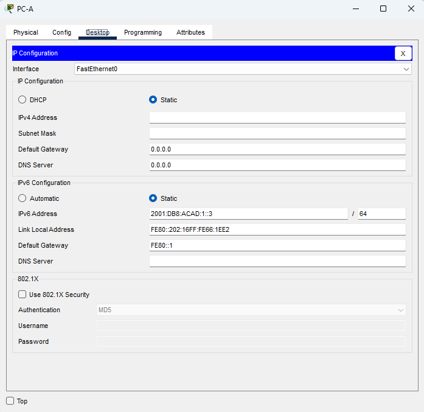
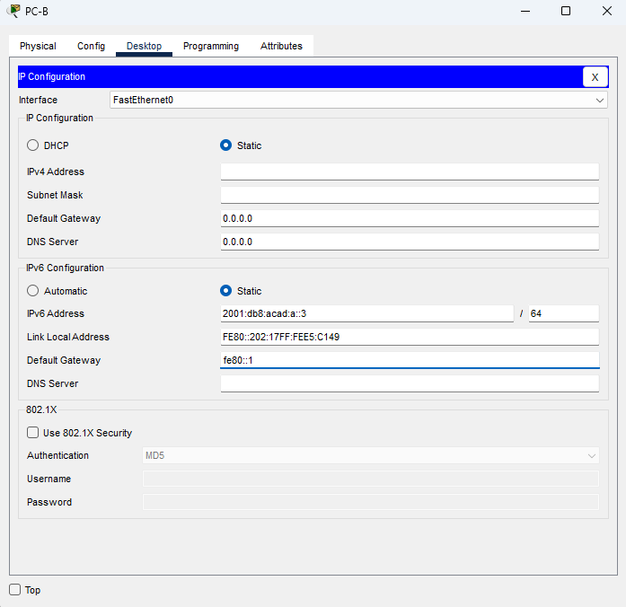
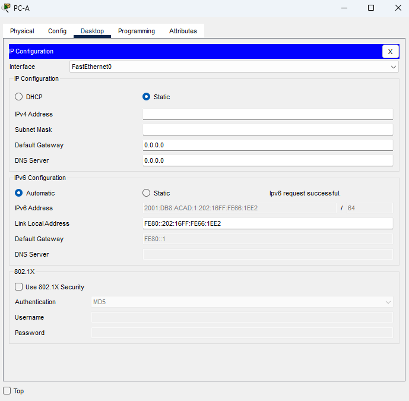
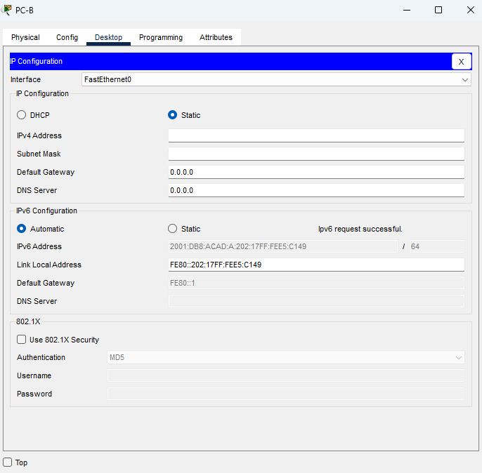

 Лабораторная работа. Настройка IPv6-адресов на сетевых устройствах

## Топология

## Таблица адресации

|Устройство | Интерфейс | IPv6-адрес       | Linc local IPv6-адрес| Длина префикса |   Шлюз по умолчанию   |
|-----------|-----------|------------------|----------------------|----------------|-----------------------|
|R1         |G0/0/0     |2001:db8:acad:a::1| fe80::1              | 64             |   -                   |
|           |G0/0/1     |2001:db8:acad:1::1| fe80::1              | 64             |   -                   |
|S1         |VLAN 1     |2001:db8:acad:1::b| fe80::b              | 64             |   -                   |
|PC-A       |NIC        |2001:db8:acad:1::3| SLACC                | 64             | fe80::1               |
|PC-B       |NIC        |2001:db8:acad:a::3| SLACC                | 64             | fe80::1               |

### Задачи

    Часть 1. Настройка топологии и конфигурация основных параметров маршрутизатора и коммутатора
    Часть 2. Ручная настройка IPv6-адресов
    Часть 3. Проверка сквозного соединения

### Решение

Убедимся, что SDM на коммутаторе S1 использует шаблон *dual-ipv4-and-ipv6* или *lanbase-routing*.
`S1# show sdm prefer`

Чтобы установить шаблон dual-ipv4-and-ipv6 в качестве шаблона SDM по умолчанию, выполним следующие действия:
    S1# configure terminal
    S1(config)# sdm prefer dual-ipv4-and-ipv6 default
    S1(config)# end

Новый шаблон будет использоваться после перезагрузки.
`S1# reload`

#### Часть 1. Настройка топологии и конфигурация основных параметров маршрутизатора и коммутатора

После подключения сети, инициализации и перезагрузки маршрутизатора и коммутатора выполнил следующие действия:

##### Шаг 1. Настроил маршрутизатор

Назначил имя хоста и настроил основные параметры.

##### Шаг 2. Настроил коммутатор

Назначил имя хоста и настройте основные параметры устройства.

#### Часть 2. Ручная настройка IPv6-адресов

##### Шаг 1. Назначу IPv6-адреса интерфейсам Ethernet на R1

a. Назначил глобальные индивидуальные IPv6-адреса, указанные в таблице адресации обоим интерфейсам Ethernet на R1.

    R1(config)#int g0/0/0
    R1(config-if)#ipv6 add
    R1(config-if)#ipv6 address 2001:db8:acad:a::1/64
    R1(config-if)#int g0/0/1
    R1(config-if)#ipv6 address 2001:db8:acad:1::1/64

b. С помощью команды **show ipv6 interface brief**, проверил, назначен ли каждому интерфейсу корректный индивидуальный IPv6-адрес.

    R1#sh ipv6 int br
    GigabitEthernet0/0/0       [administratively down/down]
        FE80::2D0:FF*FF:FE*BD:9601
        2001:DB8:ACAD:A::1
    GigabitEthernet0/0/1       [administratively down/down]
        FE80::2D0:FF*FF:FE*BD:9602
        2001:DB8:ACAD:1::1
    GigabitEthernet0/0/2       [administratively down/down]
        unassigned
    Vlan1                      [administratively down/down]
        unassigned

Убедился, что локальный адрес канала основан на адресации EUI-64, которая автоматически использует MAC-адрес интерфейса для создания 128-битного локального IPv6-адреса канала.

c. Чтобы обеспечить соответствие локальных адресов канала индивидуальному адресу, вручную ввёл локальные адреса канала на каждом интерфейсе Ethernet на R1.
Так как каждый интерфейс маршрутизатора относится к отдельной сети. Пакеты с локальным адресом канала никогда не выходят за пределы локальной сети, а значит, для обоих интерфейсов можно указывать один и тот же локальный адрес канала.

    R1(config)#int g0/0/0
    R1(config-if)#ipv6 add
    R1(config-if)#ipv6 address fe80::1 link-local
    R1(config-if)#no shutdown
    R1(config-if)#int g0/0/1
    R1(config-if)#ipv6 address fe80::1 link-local
    R1(config-if)#no shutdown

d. Используя команду **show ipv6 interface brief** убедился, что локальный адрес изменен на fe80::1.  
    R1#sh ipv6 int br
    GigabitEthernet0/0/0       [up/up]
        FE80::1
        2001:DB8:ACAD:A::1
    GigabitEthernet0/0/1       [up/up]
        FE80::1
        2001:DB8:ACAD:1::1
    GigabitEthernet0/0/2       [administratively down/down]
        unassigned
    Vlan1                      [administratively down/down]
        unassigned

##### Шаг 2. Активирую IPv6-маршрутизацию на R1

a. В командной строке на PC-B ввел команду **ipconfig**, чтобы получить данные IPv6-адреса, назначенного интерфейсу ПК.

    Connection-specific DNS Suffix..:
    Link-local IPv6 Address.........: FE80::202:17FF:FEE5:C149
    IPv6 Address....................: ::
    IPv4 Address....................: 0.0.0.0
    Subnet Mask.....................: 0.0.0.0
    Default Gateway.................: ::
                                     0.0.0.0

**Вопрос:** Назначен ли индивидуальный IPv6-адрес сетевой интерфейсной карте (NIC) на PC-B?
Мы видим, что на сетевой карте присутствует *Link-local IPv6 Address: FE80::202:17FF:FEE5:C149*

b. Активировал IPv6-маршрутизацию на R1 с помощью команды **ipv6 unicast-routing**.

c. Теперь, когда R1 входит в группу многоадресной рассылки всех маршрутизаторов, еще раз ввел команду **ipconfig** на PC-B.
Проверяем данные IPv6-адреса.

    Connection-specific DNS Suffix..:
    Link-local IPv6 Address.........: FE80::202:17FF:FEE5:C149
    IPv6 Address....................: 2001:DB8:ACAD:A:202:17FF:FEE5:C149
    IPv4 Address....................: 0.0.0.0
    Subnet Mask.....................: 0.0.0.0
    Default Gateway.................: FE80::1
                                     0.0.0.0

**Вопрос:** Почему PC-B получил глобальный префикс маршрутизации и идентификатор подсети, которые вы настроили на R1?

Потому что при активированной на маршрутизаторе ipv6 маршрутизации он начинает отвечать на **Router Solicitation (RS)** запросы от хостов.
И в ответ отправляет им сообщения **Router Advertisement (RA)**, которые служат для информирования хостов о том, как получить GUA IPv6, и предоставления полезной информации о сети,
такой как:
■ Длину префикса и префикс сети
■ Адрес шлюза по умолчанию
■ DNS-адреса и доменное имя

##### Шаг 3. Назначу IPv6-адрес интерфейсу управления (SVI) на S1

a. Назначил адрес IPv6 для S1. Также назначил этому интерфейсу локальный адрес канала.

    S1(config)#int vlan 1
    S1(config-if)#ipv6 addr 2001:db8:acad:1::b/64
    S1(config-if)#ipv6 addr fe80::2 link-local
    S1(config-if)#no shutdown

b. Проверил правильность назначения IPv6-адресов интерфейсу управления с помощью команды **show ipv6 interface vlan1**.

    S1#show ipv6 interface vlan 1
    Vlan1 is administratively down, line protocol is down
    IPv6 is tentative, link-local address is **FE80::2** [TEN]
    No Virtual link-local address(es):
    Global unicast address(es):
        **2001:DB8:ACAD:1::B**, subnet is 2001:DB8:ACAD:1::/64 [TEN]
    Joined group address(es):
        FF02::1
    MTU is 1500 bytes
    ICMP error messages limited to one every 100 milliseconds
    ICMP redirects are enabled
    ICMP unreachables are sent
    Output features: Check hwidb
    ND DAD is enabled, number of DAD attempts: 1
    ND reachable time is 30000 milliseconds

##### Шаг 4. Назначаю компьютерам статические IPv6-адреса

a. С помощью окна "Свойства Ethernet" для каждого ПК назначил адресацию IPv6.

 
 

b. Убедился, что оба компьютера имеют правильную информацию адреса IPv6.
**Каждый компьютер получает глобальные адреса IPv6: один статический и один SLACC**

#### Часть 3. Проверка сквозного подключения

С PC-A отправил эхо-запрос на FE80::1.

    C:\>ping fe80::1

    Pinging fe80::1 with 32 bytes of data:

    Reply from FE80::1: bytes=32 time<1ms TTL=255
    Reply from FE80::1: bytes=32 time<1ms TTL=255
    Reply from FE80::1: bytes=32 time=9ms TTL=255
    Reply from FE80::1: bytes=32 time<1ms TTL=255

    Ping statistics for FE80::1:
        Packets: Sent = 4, Received = 4, Lost = 0 (0% loss),
    Approximate round trip times in milli-seconds:
        Minimum = 0ms, Maximum = 9ms, Average = 2ms

Отправил эхо-запрос на интерфейс управления S1 с PC-A.

    C:\>ping 2001:db8:acad:1::b

    Pinging 2001:db8:acad:1::b with 32 bytes of data:

    Reply from 2001:DB8:ACAD:1::B: bytes=32 time=2003ms TTL=255
    Reply from 2001:DB8:ACAD:1::B: bytes=32 time<1ms TTL=255
    Reply from 2001:DB8:ACAD:1::B: bytes=32 time<1ms TTL=255
    Reply from 2001:DB8:ACAD:1::B: bytes=32 time<1ms TTL=255

    Ping statistics for 2001:DB8:ACAD:1::B:
        Packets: Sent = 4, Received = 4, Lost = 0 (0% loss),
    Approximate round trip times in milli-seconds:
        Minimum = 0ms, Maximum = 2003ms, Average = 500ms

Ввёл команду **tracert** на PC-A, чтобы проверить наличие сквозного подключения к PC-B.

    C:\>tracert 2001:db8:acad:a::3

    Tracing route to 2001:db8:acad:a::3 over a maximum of 30 hops:

    1   0 ms      0 ms      0 ms      2001:DB8:ACAD:1::1
    2   0 ms      0 ms      0 ms      2001:DB8:ACAD:A::3

    Trace complete.

С PC-B отправил эхо-запрос на PC-A.

    C:\>ping 2001:db8:acad:1::3

    Pinging 2001:db8:acad:1::3 with 32 bytes of data:

    Reply from 2001:DB8:ACAD:1::3: bytes=32 time<1ms TTL=127
    Reply from 2001:DB8:ACAD:1::3: bytes=32 time<1ms TTL=127
    Reply from 2001:DB8:ACAD:1::3: bytes=32 time<1ms TTL=127
    Reply from 2001:DB8:ACAD:1::3: bytes=32 time<1ms TTL=127

    Ping statistics for 2001:DB8:ACAD:1::3:
        Packets: Sent = 4, Received = 4, Lost = 0 (0% loss),
    Approximate round trip times in milli-seconds:
        Minimum = 0ms, Maximum = 0ms, Average = 0ms

С PC-B отправил эхо-запрос на локальный адрес канала G0/0 на R1.

    C:\>ping fe80::1

    Pinging fe80::1 with 32 bytes of data:

    Reply from FE80::1: bytes=32 time<1ms TTL=255
    Reply from FE80::1: bytes=32 time<1ms TTL=255
    Reply from FE80::1: bytes=32 time<1ms TTL=255
    Reply from FE80::1: bytes=32 time<1ms TTL=255

    Ping statistics for FE80::1:
        Packets: Sent = 4, Received = 4, Lost = 0 (0% loss),
    Approximate round trip times in milli-seconds:
        Minimum = 0ms, Maximum = 0ms, Average = 0ms

##### Вопросы для повторения

    1. Почему обоим интерфейсам Ethernet на R1 можно назначить один и тот же локальный адрес канала — FE80::1?
        link-local адрес - Это IPv6-адрес и используется только для связи внутри одного интерфейса. Никогда не маршрутизируется между интерфейсами или сетями. То есть FE80::1 на eth0 и FE80::1 на eth1 — это два разных адреса, несмотря на одинаковую запись.

    2. Какой идентификатор подсети в индивидуальном IPv6-адресе 2001:db8:acad::aaaa:1234/64?
       Идентификатор подсети (Subnet ID) в этом адресе — acad (или точнее: 0000acad в 16-битном представлении от битов 48 до 63).