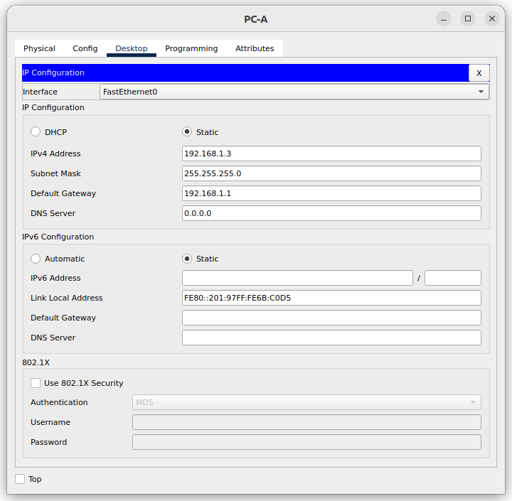
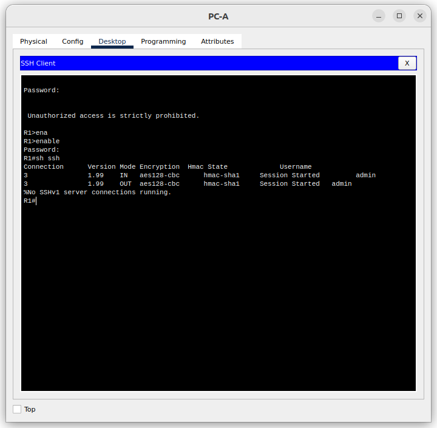
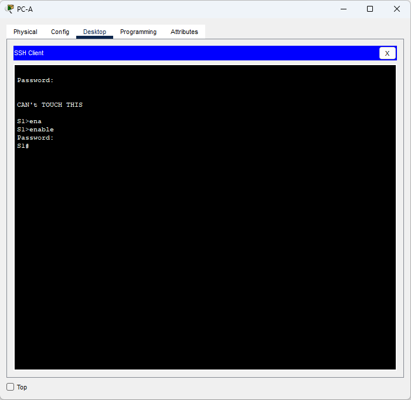

# Лабораторная работа. Доступ к сетевым устройствам по протоколу SSH

## Топология

## Таблица адресации

|Устройство | Интерфейс | IP-адрес         | Маска подсети  |   Шлюз по умолчанию   |
|-----------|-----------|------------------|----------------|-----------------------|
|R1         |G0/0/1     |192.168.1.1       | 255.255.255.0  |   -                   |
|S1         |VLAN 1     |192.168.1.11      | 255.255.255.0  |   192.168.1.1         |
|PC-A       |NIC        |192.168.1.3       | 255.255.255.0  |   192.168.1.1         |

### Задачи

    Часть 1. Настройка основных параметров устройства
    Часть 2. Настройка маршрутизатора для доступа по протоколу SSH
    Часть 3. Настройка коммутатора для доступа по протоколу SSH
    Часть 4. SSH через интерфейс командной строки (CLI) коммутатора

### Решение

*Файл CPT с полностью настроенным оборудованием [тут](lab_05.pkt)*

#### Часть 1. Настройка топологии и конфигурация основных параметров маршрутизатора и коммутатора

После подключения сети, инициализации и перезагрузки маршрутизатора и коммутатора выполнил следующие действия:

##### Шаг 1. Настройка маршрутизатора

a. Подключившись к маршрутизатору с помощью консоли активировал привилегированный режим EXEC.
b. Перешел в режим конфигурации командой **conf t**.
c. Отключил поиск DNS командой **no ip domain-lookup**.
d. Командой **enable secret class** установил зашифрованный пароль привилегированного режима EXEC.
e. Командами **line con 0 > password cisco > login** установил cisco в качестве пароля консоли и включил вход в систему по паролю.
f. Используя команды **line vty 0 4 > passord cisco > login** назначил пароль VTY и включил вход в систему по паролю.
g. Включил шифрование открытых паролей **service password-encryption**.
h. Создал баннер, который предупреждает о запрете несанкционированного доступа.
i. Установил имя маршрутизатора **hostname R1**
j. Настроил и активировал на маршрутизаторе интерфейс G0/0/1, используя информацию, приведенную в таблице адресации.
    R1(config)#int g0/0/1
    R1(config-if)#ip address 192.168.1.1 255.255.255.0
    R1(config-if)#no shutdown
j. Сохранил текущую конфигурацию в файл загрузочной конфигурации:
    R1# copy run startup-config

##### Шаг 2. Настроил компьютер PC-A

##### Шаг 3. Проверка подключения к сети

Послал команду **ping** с компьютера на маршрутизатор R1:
    C:\> ping 192.168.1.1

    Pinging 192.168.1.1 with 32 bytes of data:

    Reply from 192.168.1.1: bytes=32 time<1ms TTL=255
    Reply from 192.168.1.1: bytes=32 time<1ms TTL=255
    Reply from 192.168.1.1: bytes=32 time<1ms TTL=255
    Reply from 192.168.1.1: bytes=32 time<1ms TTL=255

    Ping statistics for 192.168.1.1:
        Packets: Sent = 4, Received = 4, Lost = 0 (0% loss),
    Approximate round trip times in milli-seconds:
        Minimum = 0ms, Maximum = 0ms, Average = 0ms

Эхо-запросы проходят - сеть работает.

#### Часть 2. Настройка маршрутизатора для доступа по протоколу SSH

##### Шаг 1. Настройка аутентификацию устройств

a. Имя устройства назначил на предыдущем шаге

b. Задал домен для устройства:
    `R1(config)#ip domain-name otus.cisco`

##### Шаг 2. Создание ключа шифрования

a. Создал ключ шифрования командой **crypto key generate rsa** и указал длину ключа 1024 бита.

##### Шаг 3. Создание пользователя

Настроил имя пользователя:
`R1(config)#username admin password Adm1nP@55`

##### Шаг 4. Активация протокола SSH на линиях VTY

a. Активировал протокол SSH на входящих линиях VTY с помощью команды **transport input**.
b. Изменил способ входа в систему таким образом, чтобы использовалась проверка пользователей по локальной базе учетных записей.

    R1(config-line)#line vty 0 4
    R1(config-line)#transport input ssh
    R1(config-line)#login local

##### Шаг 5. Сохранение текущей конфигурации в файл загрузочной конфигурации

Используя **R1# copy run startup-config** сохранил все изменения в файл загрузочной конфигурации.

##### Шаг 6. Установка соединения с маршрутизатором по протоколу SSH

a. Запустите SSH-клиента на PC-A.
b. Установил SSH-подключение к R1.

#### Часть 3. Настройка коммутатора для доступа по протоколу SSH

##### Шаг 1. Настройка основных параметров коммутатора

Настроил коммутатор аналогично маршрутизатору R1.

##### Шаг 2. Настройка коммутатора для соединения по протоколу SSH

Для настройки протокола SSH на коммутаторе использовал те же команды, которые применялись для аналогичной настройки маршрутизатора в части 2.

##### Шаг 3. Соединение с коммутатором по протоколу SSH

a. Запустил SSH-клиент на PC-A.
b. Установил SSH-подключение к S1.

*Удалось ли вам установить SSH-соединение с коммутатором?* **Да**

#### Часть 4. Часть 4. Настройка протокола SSH с использованием интерфейса командной строки (CLI) коммутатора

##### Шаг 1. Просмотр доступных параметров для клиента SSH в Cisco IOS

Через CLI коммутатора посмотрел варианты для команды **ssh**

    S1#ssh ?
        -l  Log in using this user name
        -v  Specify SSH Protocol Version

Перечень в CPT урезан, по сравнению с "живым" коммутатором.

##### Шаг 2. Установка с коммутатора S1 соединения с маршрутизатором R1 по протоколу SSH

a. Чтобы подключиться к маршрутизатору R1 по протоколу SSH, ввел команду **ssh -l admin 192.168.1.1**. При появлении приглашения ввёл установленный ранее пароль
    S1#ssh -l admin 192.168.1.1
    Password:
    Unauthorized access is strictly prohibited.
    R1>

b. *Чтобы вернуться к коммутатору S1, не закрывая сеанс SSH с маршрутизатором R1, нажмите комбинацию клавиш Ctrl+Shift+6. Отпустите клавиши Ctrl+Shift+6 и нажмите x. Отображается приглашение привилегированного режима EXEC коммутатора.* **Проверил - работает**
    R1>
    S1#

c. Чтобы вернуться к сеансу SSH на R1, нажмите клавишу Enter в пустой строке интерфейса командной строки. Чтобы увидеть окно командной строки маршрутизатора, нажмите клавишу Enter еще раз.
    S1#
    [Resuming connection 1 to 192.168.1.1 ... ]

    R1>

d.Чтобы завершить сеанс SSH на маршрутизаторе R1, введите в командной строке маршрутизатора команду **exit**.
    R1# exit

    [Connection to 192.168.1.1 closed by foreign host]
    S1#

*Какие версии протокола SSH поддерживаются при использовании интерфейса командной строки?*
**Коммутатор 2960 под управлением IOS версии 15.0(2) поддерживает SSH v1 и V2.**

##### Вопросы для повторения

    1. Как предоставить доступ к сетевому устройству нескольким пользователям, у каждого из которых есть собственное имя пользователя?
         Нужно добавить имя пользователя и пароль каждого пользователя в локальную базу данных с помощью команды **username**.