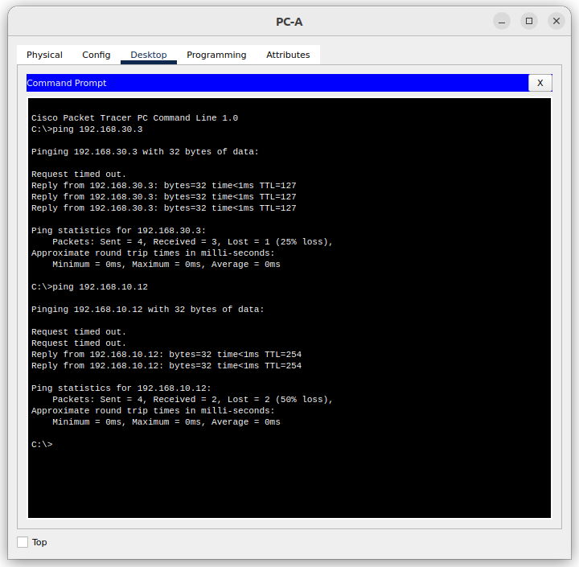

# Лабораторная работа. Внедрение маршрутизации между виртуальными локальными сетями

## Топология

## Таблица адресации

|Устройство | Интерфейс | IP-адрес         | Маска подсети  |   Шлюз по умолчанию   |
|-----------|-----------|------------------|----------------|-----------------------|
|R1         |G0/0/1.10  |192.168.10.1      | 255.255.255.0  |   -                   |
|           |G0/0/1.20  |192.168.20.1      | 255.255.255.0  |   -                   |
|           |G0/0/1.30  |192.168.30.1      | 255.255.255.0  |   -                   |
|           |G0/0/1.1000|--                | --             |   --                  |
|S1         |VLAN 10    |192.168.10.11     | 255.255.255.0  |   192.168.10.1        |
|S2         |VLAN 10    |192.168.10.12     | 255.255.255.0  |   192.168.10.1        |
|PC-A       |NIC        |192.168.20.3      | 255.255.255.0  |   192.168.20.1        |
|PC-B       |NIC        |192.168.30.3      | 255.255.255.0  |   192.168.30.1        |

## Таблица VLAN

|VLAN       | Имя       | Назначенный интерфейс         |
|-----------|-----------|------------------|
|10         |Управление |S1: VLAN 10       |
|           |           |S2: VLAN 10       |
|20         |Sales      |S1: F0/6          |
|30         |Operations |S2: F0/18         |
|999        |Parking_lot|S1: F0/2-4, F0/7-24, G0/1-2 |
|           |           |S2: F0/2-17, F0/19-24, G0/1-2     |
|1000       |My_native_vlan     |--      |

### Задачи

    Часть 1. Создание сети и настройка основных параметров устройства
    Часть 2. Создание сетей VLAN и назначение портов коммутатора
    Часть 3. Настройка транка 802.1Q между коммутаторами.
    Часть 4. Настройка маршрутизации между сетями VLAN
    Часть 5. Проверка, что маршрутизация между VLAN работает

### Решение

#### Часть 1. Создание сети и настройка основных параметров устройств

##### Шаг 1. Создание сети согласно топологии

Подключил устройства, как показано в топологии, и подсоединил необходимые кабели.

##### Шаг 2. Настройка маршрутизатора

    a. Подключившись к маршрутизатору с помощью консоли активировал привилегированный режим EXEC.
    b. Перешел в режим конфигурации командой **conf t**.
    c. Отключил поиск DNS командой **no ip domain-lookup**.
    d. Командой **enable secret class** установил зашифрованный пароль привилегированного режима EXEC.
    e. Командами **line con 0 > password cisco > login** установил cisco в качестве пароля консоли и включил вход в систему по паролю.
    f. Используя команды **line vty 0 4 > passord cisco > login ** назначил пароль VTY и включил вход в систему по паролю.
    g. Включил шифрование открытых паролей **service password-encryption**.
    h. Установил имя маршрутизатора **hostname R1** 
    i. Сохранил текущую конфигурацию в файл загрузочной конфигурации:
        R1# copy run startup-config
    j. Настроил время 

##### Шаг 3. Настроил базовые параметры каждого коммутатора

    a. Присвоил коммутаторам имя **hostname S1** и **hostname S2** 
    b. Отключил поиск DNS командой **no ip domain-lookup**
    c. Командой **enable secret class** установил зашифрованный пароль привилегированного режима EXEC.
    d. Командами **line con 0 > password cisco > login** установил cisco в качестве пароля консоли и включил вход в систему по паролю.
    e. Используя команды **line vty 0 4 > passord cisco > login ** назначил пароль VTY и включил вход в систему по паролю.
    f. Включил шифрование открытых паролей **service password-encryption**.
    g. Настроил на коммутаторах время.
    h. Сохранил текущую конфигурацию в качестве стартовой командой **copy run start**.

##### Шаг 3. Настроил компьютеры

Настройки сетевой карты компьютера PC-A

Настройки сетевой карты компьютера PC-B

#### Часть 2. Создание сетей VLAN и назначение портов коммутатора

##### Шаг 1. Создание сети VLAN на коммутаторах

Настройку этого задания привожу на основе коммутатора **S1**.
a. Создание и именование необходимых VLAN на каждом коммутаторе. Данные взял из таблицы:

    S1(config)#vlan 10
    S1(config-vlan)#name MGMNT
    S1(config-vlan)#vlan 20
    S1(config-vlan)#name Sales
    S1(config-vlan)#vlan 30
    S1(config-vlan)#name Operations
    S1(config-vlan)#vlan 999
    S1(config-vlan)#name Parking_Lot
    S1(config-vlan)#vlan 1000
    S1(config-vlan)#name my_native_vlan
    S1(config-vlan)#exit

b. Настройка интерфейса управления и шлюза по умолчанию:

    S1(config)#int vlan 10
    S1(config-if)#ip address 192.168.10.11 255.255.255.0
    S1(config-if)#exit
    S1(config)#ip default-gateway 192.168.10.1

c. Назначил все неиспользуемые порты коммутатора VLAN Parking_Lot, настроил их для статического режима доступа и административно деактивировал их.
Очень пригодилась команда **interface range**.

    S1(config)#int range F0/2-4, F0/7-24, G0/1-2
    S1(config-if-range)#sw mode ac
    S1(config-if-range)#sw acc vl 999
    S1(config-if-range)#shutdown
    S1(config-if-range)#exit

##### Шаг 2. Назначение сети VLAN соответствующим интерфейсам коммутатора

a. Назначил используемым портам соответствующий VLAN и настроил их для режима статического доступа.

    S1(config)#int f0/6
    S1(config-if)#sw mo ac
    S1(config-if)#sw ac vl 20
    S1(config-if)#description Sales_PC

b. Убедился, что VLAN назначены на правильные интерфейсы.

    S1#sh vlan 

    VLAN Name                             Status    Ports
    ---- -------------------------------- --------- -------------------------------
    1    default                          active    Fa0/1, Fa0/5
    10   MGMNT                            active    
    20   Sales                            active    Fa0/6
    30   Operations                       active    
    999  Parking_Lot                      active    Fa0/2, Fa0/3, Fa0/4, Fa0/7
                                                    Fa0/8, Fa0/9, Fa0/10, Fa0/11
                                                    Fa0/12, Fa0/13, Fa0/14, Fa0/15
                                                    Fa0/16, Fa0/17, Fa0/18, Fa0/19
                                                    Fa0/20, Fa0/21, Fa0/22, Fa0/23
                                                    Fa0/24, Gig0/1, Gig0/2
    1000 my_native_vlan                   active    

#### Часть 3.Конфигурация магистрального канала стандарта 802.1Q между коммутаторами

##### Шаг 1. Вручную настроил магистральный интерфейс F0/1 на коммутаторах S1 и S2

a. Настройка статического транкинга на интерфейсе F0/1 для обоих коммутаторов.

    S1(config)#int f0/1
    S1(config-if)#sw mode tr

b. Установил native VLAN 1000 на обоих коммутаторах.

    S1(config-if)#sw tr native vlan 1000

c. Указал, что VLAN 10, 20, 30 и 1000 могут проходить по транку.

    S1(config-if)#sw tr all vlan 10,20,30,1000

d. Проверил транки, native VLAN и разрешенные VLAN через транк.

    S1#sh int f0/1 switchport 
        Name: Fa0/1
        Switchport: Enabled
        *Administrative Mode: trunk*
        Operational Mode: trunk
        Administrative Trunking Encapsulation: dot1q
        Operational Trunking Encapsulation: dot1q
        Negotiation of Trunking: Off
        Access Mode VLAN: 1 (default)
        *Trunking Native Mode VLAN: 1000 (my_native_vlan)*
        Voice VLAN: none
        Administrative private-vlan host-association: none
        Administrative private-vlan mapping: none
        Administrative private-vlan trunk native VLAN: none
        Administrative private-vlan trunk encapsulation: dot1q
        Administrative private-vlan trunk normal VLANs: none
        Administrative private-vlan trunk private VLANs: none
        Operational private-vlan: none
        *Trunking VLANs Enabled: 10,20,30,1000*
        Pruning VLANs Enabled: 2-1001
        Capture Mode Disabled
        Capture VLANs Allowed: ALL
        Protected: false
        Unknown unicast blocked: disabled
        Unknown multicast blocked: disabled
        Appliance trust: none

##### Шаг 2. Ручная настройка магистрального интерфейса F0/5 на коммутаторе S1

a. Настроил интерфейс S1 F0/5 с теми же параметрами транка, что и F0/1. Это транк до маршрутизатора.

    S1(config)#int f0/5
    S1(config-if)#sw mode tr
    S1(config-if)#sw tr native vlan 1000
    S1(config-if)#sw tr all vlan 10,20,30,1000

b. Сохранил текущую конфигурацию в файл загрузочной конфигурации.

c. Проверка транкинга.

    S1#sh int f0/5 switchport 
        Name: Fa0/5
        Switchport: Enabled
        Administrative Mode: trunk
        Operational Mode: trunk
        Administrative Trunking Encapsulation: dot1q
        Operational Trunking Encapsulation: dot1q
        Negotiation of Trunking: Off
        Access Mode VLAN: 1 (default)
        Trunking Native Mode VLAN: 1000 (my_native_vlan)
        Voice VLAN: none
        Administrative private-vlan host-association: none
        Administrative private-vlan mapping: none
        Administrative private-vlan trunk native VLAN: none
        Administrative private-vlan trunk encapsulation: dot1q
        Administrative private-vlan trunk normal VLANs: none
        Administrative private-vlan trunk private VLANs: none
        Operational private-vlan: none
        Trunking VLANs Enabled: 10,20,30,1000
        Pruning VLANs Enabled: 2-1001
        Capture Mode Disabled
        Capture VLANs Allowed: ALL
        Protected: false
        Unknown unicast blocked: disabled
        Unknown multicast blocked: disabled
        Appliance trust: none

**Вопрос:** Что произойдет, если G0/0/1 на R1 будет отключен?
Т.к. нет синхронизации между интерфейсами, то ничего не произойдёт и сообщений не будет.

#### Часть 4. Настройка Маршрутизации между сетями VLAN

##### Шаг 1. Настройка маршрутизатора

a. Аактивировал интерфейс G0/0/1 на маршрутизаторе.
b. Настроил подинтерфейсы для каждой VLAN, как указано в таблице IP-адресации. Все подинтерфейсы используют инкапсуляцию 802.1Q. При настройке включил описание для каждого подинтерфейса.

    R1(config)#int g0/0/1.10
    R1(config-subif)#encapsulation dot1q 10
    R1(config-subif)#ip addr 192.168.10.1 255.255.255.0
    R1(config-subif)#description MNGMNT
    R1(config-subif)#int g0/0/1.20
    R1(config-subif)#encapsulation dot1q 20
    R1(config-subif)#ip addr 192.168.20.1 255.255.255.0
    R1(config-subif)#descr Sales
    R1(config-subif)#int g0/0/1.30
    R1(config-subif)#encapsulation dot1q 30
    R1(config-subif)#ip addr 192.168.30.1 255.255.255.0
    R1(config-subif)#descr Operations
    R1(config-subif)#int g0/0/1.1000
    R1(config-subif)#encapsulation dot1Q 1000 native 
    R1(config-subif)#description my_native_vlan

Убедился, что подинтерфейсу для native VLAN не назначен IP-адрес.
На подинтерфейсе **VLAN 10** есть адрес:

    R1#sh interfaces gigabitEthernet 0/0/1.10
        GigabitEthernet0/0/1.10 is up, line protocol is up (connected)
        Hardware is PQUICC_FEC, address is 00d0.bcb7.d402 (bia 00d0.bcb7.d402)
        **Internet address is 192.168.10.1/24**
        MTU 1500 bytes, BW 100000 Kbit, DLY 100 usec,
            reliability 255/255, txload 1/255, rxload 1/255
        Encapsulation 802.1Q Virtual LAN, Vlan ID 10
        ARP type: ARPA, ARP Timeout 04:00:00,
        Last clearing of "show interface" counters never

На **native VLAN** нет:

    R1#sh interfaces gigabitEthernet 0/0/1.1000
        GigabitEthernet0/0/1.1000 is up, line protocol is up (connected)
        Hardware is PQUICC_FEC, address is 00d0.bcb7.d402 (bia 00d0.bcb7.d402)
        MTU 1500 bytes, BW 100000 Kbit, DLY 100 usec, 
            reliability 255/255, txload 1/255, rxload 1/255
        Encapsulation 802.1Q Virtual LAN, Vlan ID 1000
        ARP type: ARPA, ARP Timeout 04:00:00, 
        Last clearing of "show interface" counters never

c. Убедился, что вспомогательные интерфейсы работают. Проверил маршрутизацию:

    R1#show ip route
        Codes: L - local, C - connected, S - static, R - RIP, M - mobile, B - BGP
            D - EIGRP, EX - EIGRP external, O - OSPF, IA - OSPF inter area
            N1 - OSPF NSSA external type 1, N2 - OSPF NSSA external type 2
            E1 - OSPF external type 1, E2 - OSPF external type 2, E - EGP
            i - IS-IS, L1 - IS-IS level-1, L2 - IS-IS level-2, ia - IS-IS inter area
            * - candidate default, U - per-user static route, o - ODR
            P - periodic downloaded static route

        Gateway of last resort is not set

            192.168.10.0/24 is variably subnetted, 2 subnets, 2 masks
        C       192.168.10.0/24 is directly connected, GigabitEthernet0/0/1.10
        L       192.168.10.1/32 is directly connected, GigabitEthernet0/0/1.10
            192.168.20.0/24 is variably subnetted, 2 subnets, 2 masks
        C       192.168.20.0/24 is directly connected, GigabitEthernet0/0/1.20
        L       192.168.20.1/32 is directly connected, GigabitEthernet0/0/1.20
            192.168.30.0/24 is variably subnetted, 2 subnets, 2 masks
        C       192.168.30.0/24 is directly connected, GigabitEthernet0/0/1.30
        L       192.168.30.1/32 is directly connected, GigabitEthernet0/0/1.30

#### Часть 5. Проверка работы маршрутизации между VLAN

##### Шаг 1. Выполнил тесты с PC-A

a. Отправил эхо-запрос с PC-A на шлюз по умолчанию.

b. Отправил эхо-запрос с PC-A на PC-B.
c. Отправил команду ping с компьютера PC-A на коммутатор S2.

##### Шаг 2. Выполнил тест с PC-B

В окне командной строки на PC-B выполните команду tracert на адрес PC-A.

**Вопрос:** Какие промежуточные IP-адреса отображаются в результатах?

    Видим, что в результате отобразился адрес шлюза для сети компьютера PC-B и конечный узел - компьютер PC-A
