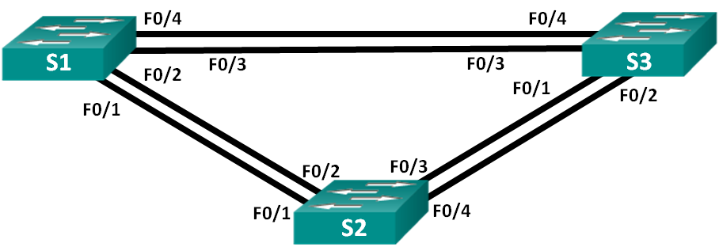
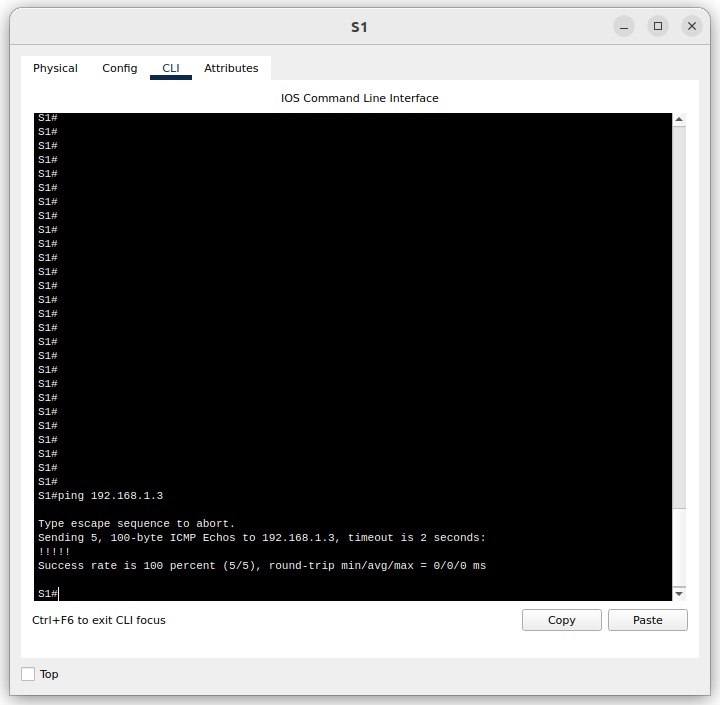
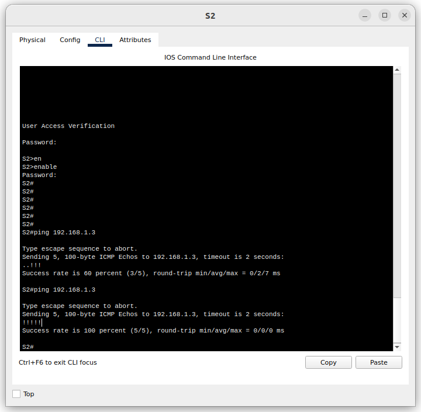
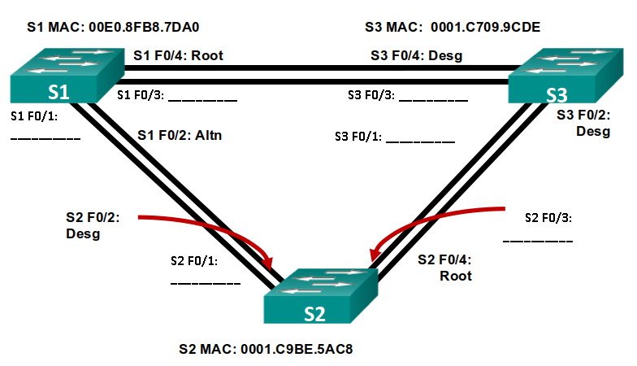

# Лабораторная работа. Развертывание коммутируемой сети с резервными каналами

## Топология

## Таблица адресации

|Устройство | Интерфейс | IP-адрес       | Маска подсети  |
|-----------|-----------|----------------|----------------|
|S1         |VLAN 1     |192.168.1.1     | 255.255.255.0  |
|S2         |VLAN 1     |192.168.1.2     | 255.255.255.0  |
|S3         |VLAN 1     |192.168.1.3     | 255.255.255.0  |

### Цели

Часть 1. Создание сети и настройка основных параметров устройства
Часть 2. Выбор корневого моста
Часть 3. Наблюдение за процессом выбора протоколом STP порта, исходя из стоимости портов
Часть 4. Наблюдение за процессом выбора протоколом STP порта, исходя из приоритета портов

### Решение

#### Часть 1. Создание сети и настройка основных параметров устройств

##### Шаг 1. Создание сети согласно топологии

Подключил устройства, как показано в топологии, и подсоединил необходимые кабели.

##### Шаг 2-3. Выполнил инициализацию и перезагрузку коммутаторов. Настроил базовые параметры каждого коммутатора

    a. Присвоил коммутаторам имя **hostname S1**, **hostname S2**, **hostname S3**
    b. Отключил поиск DNS командой **no ip domain-lookup**
    c. Командой **enable secret class** установил зашифрованный пароль привилегированного режима EXEC.
    d. Командами **line con 0 > password cisco > login** установил cisco в качестве пароля консоли и включил вход в систему по паролю.
    e. Используя команды **line vty 0 4 > passord cisco > login ** назначил пароль VTY и включил вход в систему по паролю.
    f. Включил шифрование открытых паролей **service password-encryption**.
    g. Настроил на коммутаторах время.
    h. Задал IP-адрес, указанный в таблице адресации для VLAN 1 на всех коммутаторах.
    i. Сохранил текущую конфигурацию в качестве стартовой командой **copy run start**.

##### Шаг 4. Проверил связь

Проверил способность коммутаторов обмениваться эхо-запросами.

Успешно ли выполняется эхо-запрос от коммутатора S1 на коммутатор S2?

Успешно ли выполняется эхо-запрос от коммутатора S1 на коммутатор S3?

Успешно ли выполняется эхо-запрос от коммутатора S2 на коммутатор S3?

#### Часть 2.Определение корневого моста

##### Шаг 1. Отключил все порты на коммутаторах

Отключил все порты на всех коммутаторах (на примере **S1**):

    S1(config)#int range fa0/1-4
    S1(config-if-range)#shutdown 

##### Шаг 2: Настройте подключенные порты в качестве транковых

Настроил подключенные порты на всех коммутаторах в качестве транковых (на примере **S1**):

    S1(config-if-range)#sw mode trunk 
    S1(config-if-range)#sw trunk allowed vlan 1
    S1(config-if-range)#exit

##### Шаг 3: Включите порты F0/2 и F0/4 на всех коммутаторах

Включил порты F0/2 и F0/4 на всех коммутаторах (на примере **S1**):

    S1(config)#int range fa0/2,fa0/4
    S1(config-if-range)#no shutdown 
    %LINK-5-CHANGED: Interface FastEthernet0/2, changed state to down
    %LINK-5-CHANGED: Interface FastEthernet0/4, changed state to down
    S1(config-if-range)#

##### Шаг 4: Отобразите данные протокола spanning-tree

    S1#show spanning-tree 
    VLAN0001
        Spanning tree enabled protocol ieee
        Root ID    Priority    32769
                    Address     0001.C709.9CDE
                    Cost        19
                    Port        4(FastEthernet0/4)
                    Hello Time  2 sec  Max Age 20 sec  Forward Delay 15 sec

        **Bridge ID  Priority    32769  (priority 32768 sys-id-ext 1)
                    Address     00E0.8FB8.7DA0**
                    Hello Time  2 sec  Max Age 20 sec  Forward Delay 15 sec
                    Aging Time  20

    Interface        Role Sts Cost      Prio.Nbr Type
    ---------------- ---- --- --------- -------- --------------------------------
    Fa0/2            Altn BLK 19        128.2    P2p
    Fa0/4            Root FWD 19        128.4    P2p

    S2#sh spanning-tree 
    VLAN0001
        Spanning tree enabled protocol ieee
        Root ID    Priority    32769
                    Address     0001.C709.9CDE
                    Cost        19
                    Port        4(FastEthernet0/4)
                    Hello Time  2 sec  Max Age 20 sec  Forward Delay 15 sec

        **Bridge ID  Priority    32769  (priority 32768 sys-id-ext 1)
                    Address     0001.C9BE.5AC8**
                    Hello Time  2 sec  Max Age 20 sec  Forward Delay 15 sec
                    Aging Time  20

    Interface        Role Sts Cost      Prio.Nbr Type
    ---------------- ---- --- --------- -------- --------------------------------
    Fa0/4            Root FWD 19        128.4    P2p
    Fa0/2            Desg FWD 19        128.2    P2p

    S3#sh spanning-tree 
    VLAN0001
        Spanning tree enabled protocol ieee
        Root ID    Priority    32769
                    Address     0001.C709.9CDE
                    This bridge is the root
                    Hello Time  2 sec  Max Age 20 sec  Forward Delay 15 sec

        **Bridge ID  Priority    32769  (priority 32768 sys-id-ext 1)
                    Address     0001.C709.9CDE**
                    Hello Time  2 sec  Max Age 20 sec  Forward Delay 15 sec
                    Aging Time  20

    Interface        Role Sts Cost      Prio.Nbr Type
    ---------------- ---- --- --------- -------- --------------------------------
    Fa0/2            Desg FWD 19        128.2    P2p
    Fa0/4            Desg FWD 19        128.4    P2p

С учетом выходных данных, поступающих с коммутаторов, ответьте на следующие вопросы.

**Какой коммутатор является корневым мостом?** Коммутатор **S3**

**Почему этот коммутатор был выбран протоколом spanning-tree в качестве корневого моста?** По причине того, что у него самое низкое значение MAC-адреса при одинаковых приоритетах, установленных на всех коммутаторах

**Какие порты на коммутаторе являются корневыми портами?** Те порты, которые смотрят в сторону *корневого моста*, т.к. эти порты обладают наименьшей стоимостью для его достижения. В моем случае на коммутаторах **S1** и **S2** это порт **Fa0/4**.

**Какие порты на коммутаторе являются назначенными портами?**  Порты, используемые для восстановления связи с корневым мостом

**Какой порт отображается в качестве альтернативного и в настоящее время заблокирован?** Порт **Fa0/2** коммутатора **S1**

**Почему протокол spanning-tree выбрал этот порт в качестве невыделенного (заблокированного) порта?** Сначала сравнивается стоимость пути до корневого моста. Для этой пары портов стоимость одинакова. По этой причине сравниваются BID коммутаторов. Видим что BID коммутатора S2 меньше BID коммутатора S1.

#### Часть 3: Наблюдение за процессом выбора протоколом STP порта, исходя из стоимости портов

##### Шаг 1. Определим коммутатор с заблокированным портом

Выполнил команду **show spanning-tree** на обоих коммутаторах некорневого моста (результаты выполнения команд приведены выше).
Вижу, что протокол spanning-tree блокирует порт Fa0/2 на коммутаторе с самым высоким идентификатором BID (S1).

##### Шаг 2: Изменим стоимость порта

Вижу, что помимо заблокированного порта, единственным активным портом на этом коммутаторе является порт, выделенный в качестве порта корневого моста.
Уменьшу стоимость этого порта корневого моста до 18, выполнив команду **spanning-tree vlan 1 cost 18** режима конфигурации интерфейса.

    S1(config)#int fa0/4
    S1(config-if)#spanning-tree vlan 1 cost 18

##### Шаг 3: Смотрим изменения протокола spanning-tree

Повторно выполнил команду **show spanning-tree** на обоих коммутаторах некорневого моста.
Коммутатор **S1**:

    S1#show spanning-tree 
    VLAN0001
        Spanning tree enabled protocol ieee
        Root ID    Priority    32769
                    Address     0001.C709.9CDE
                    Cost        18
                    Port        4(FastEthernet0/4)
                    Hello Time  2 sec  Max Age 20 sec  Forward Delay 15 sec

        Bridge ID  Priority    32769  (priority 32768 sys-id-ext 1)
                    Address     00E0.8FB8.7DA0
                    Hello Time  2 sec  Max Age 20 sec  Forward Delay 15 sec
                    Aging Time  20

    Interface        Role Sts Cost      Prio.Nbr Type
    ---------------- ---- --- --------- -------- --------------------------------
    Fa0/2            Desg FWD 19        128.2    P2p
    Fa0/4            Root FWD 18        128.4    P2p

Коммутатор **S2**:

    S2#sh spanning-tree 
    VLAN0001
        Spanning tree enabled protocol ieee
        Root ID    Priority    32769
                    Address     0001.C709.9CDE
                    Cost        19
                    Port        4(FastEthernet0/4)
                    Hello Time  2 sec  Max Age 20 sec  Forward Delay 15 sec

        Bridge ID  Priority    32769  (priority 32768 sys-id-ext 1)
                    Address     0001.C9BE.5AC8
                    Hello Time  2 sec  Max Age 20 sec  Forward Delay 15 sec
                    Aging Time  20

    Interface        Role Sts Cost      Prio.Nbr Type
    ---------------- ---- --- --------- -------- --------------------------------
    Fa0/4            Root FWD 19        128.4    P2p
    Fa0/2            Altn BLK 19        128.2    P2p

Вижу, что ранее заблокированный порт (**S1** – **fa0/2**) теперь является назначенным портом, и протокол spanning-tree теперь блокирует порт на другом коммутаторе некорневого моста (**S2** – **fa0/2**).

**Почему протокол spanning-tree заменяет ранее заблокированный порт на назначенный порт и блокирует порт, который был назначенным портом на другом коммутаторе?** По той причине, что протокол сначала сравнивает стоимость пути до корневого моста. А мы вручную её уменьшили.

##### Шаг 4: Удалим изменения стоимости порта

Выполнил команду **no spanning-tree vlan 1 cost 18** режима конфигурации интерфейса, чтобы удалить запись стоимости, созданную ранее.

    S1(config)#int fa0/4
    S1(config-if)# no spanning-tree vlan 1 cost 18

Повторно выполнил команду **show spanning-tree**, чтобы подтвердить, что протокол STP сбросил порт на коммутаторе некорневого моста, вернув исходные настройки порта. Обратил внимание, что протоколу STP требуется время, чтобы завершить процесс перевода порта.

    S1#show spanning-tree 
    VLAN0001
        Spanning tree enabled protocol ieee
        Root ID    Priority    32769
                    Address     0001.C709.9CDE
                    Cost        19
                    Port        4(FastEthernet0/4)
                    Hello Time  2 sec  Max Age 20 sec  Forward Delay 15 sec

        Bridge ID  Priority    32769  (priority 32768 sys-id-ext 1)
                    Address     00E0.8FB8.7DA0
                    Hello Time  2 sec  Max Age 20 sec  Forward Delay 15 sec
                    Aging Time  20

    Interface        Role Sts Cost      Prio.Nbr Type
    ---------------- ---- --- --------- -------- --------------------------------
    Fa0/2            Altn BLK 19        128.2    P2p
    Fa0/4            Root FWD 19        128.4    P2p

#### Часть 4: Наблюдение за процессом выбора протоколом STP порта, исходя из приоритета портов

Включил порты F0/1 и F0/3 на всех коммутаторах.

Через 30 секунд, в течение которых протокол STP завершает процесс перевода порта, выполнил команду **show spanning-tree** на коммутаторах некорневого моста.

    S1#show spanning-tree 
        VLAN0001
        Spanning tree enabled protocol ieee
        Root ID    Priority    32769
                    Address     0001.C709.9CDE
                    Cost        19
                    Port        3(FastEthernet0/3)
                    Hello Time  2 sec  Max Age 20 sec  Forward Delay 15 sec

        Bridge ID  Priority    32769  (priority 32768 sys-id-ext 1)
                    Address     00E0.8FB8.7DA0
                    Hello Time  2 sec  Max Age 20 sec  Forward Delay 15 sec
                    Aging Time  20

    Interface        Role Sts Cost      Prio.Nbr Type
    ---------------- ---- --- --------- -------- --------------------------------
    Fa0/2            Altn BLK 19        128.2    P2p
    Fa0/1            Altn BLK 19        128.1    P2p
    Fa0/4            Altn BLK 19        128.4    P2p
    Fa0/3            Root FWD 19        128.3    P2p

    S2#show spanning-tree 
    VLAN0001
        Spanning tree enabled protocol ieee
        Root ID    Priority    32769
                    Address     0001.C709.9CDE
                    Cost        19
                    Port        3(FastEthernet0/3)
                    Hello Time  2 sec  Max Age 20 sec  Forward Delay 15 sec

        Bridge ID  Priority    32769  (priority 32768 sys-id-ext 1)
                    Address     0001.C9BE.5AC8
                    Hello Time  2 sec  Max Age 20 sec  Forward Delay 15 sec
                    Aging Time  20

    Interface        Role Sts Cost      Prio.Nbr Type
    ---------------- ---- --- --------- -------- --------------------------------
    Fa0/1            Desg FWD 19        128.1    P2p
    Fa0/2            Desg FWD 19        128.2    P2p
    Fa0/3            Root FWD 19        128.3    P2p
    Fa0/4            Altn BLK 19        128.4    P2p

Обратил внимание, что порт корневого моста переместился на порт с меньшим номером, связанный с коммутатором корневого моста, и заблокировал предыдущий порт корневого моста.

**Какой порт выбран протоколом STP в качестве порта корневого моста на каждом коммутаторе некорневого моста?** В моем случае на коммутаторах **S1** и **S2** это порты **Fa0/3**.

**Почему протокол STP выбрал эти порты в качестве портов корневого моста на этих коммутаторах?** Так как стоимости портов в моем случае (fa0/3 и fa0/4) равны, то протокол для определения корневого моста используются приоритеты портов. Наиболее низкие значения являются предпочтительными.

#### Вопросы для повторения

**1. Какое значение протокол STP использует первым после выбора корневого моста, чтобы определить выбор порта?** Стоимость маршрута.

**2. Если первое значение на двух портах одинаково, какое следующее значение будет использовать протокол STP при выборе порта?** Приоритеты портов.

**3. Если оба значения на двух портах равны, каким будет следующее значение, которое использует протокол STP при выборе порта?** BID коммутаторов.
