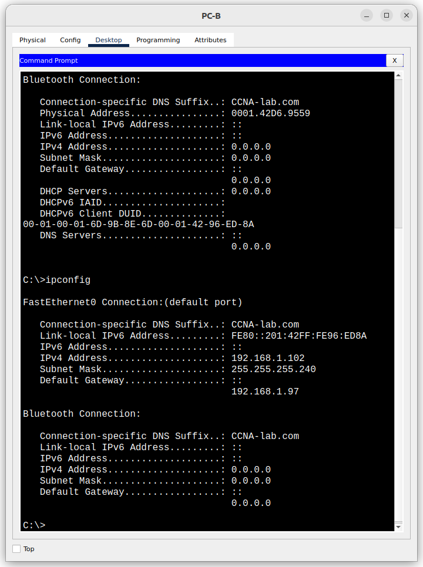
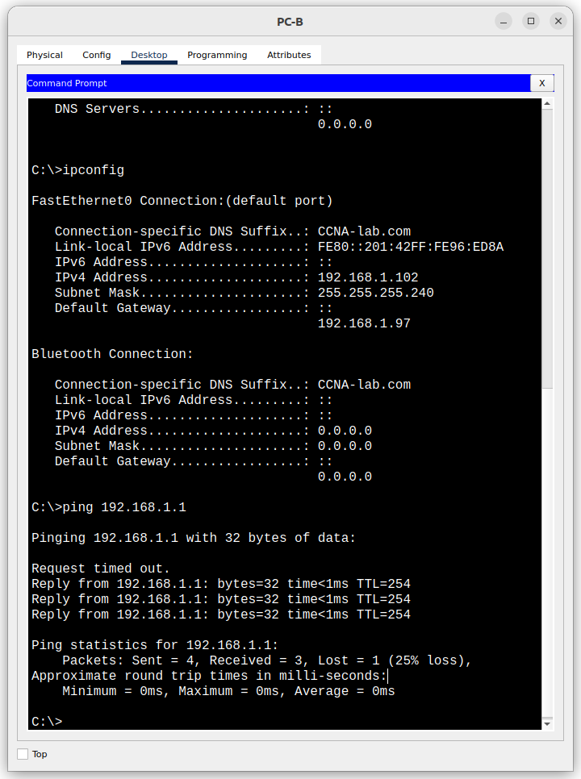

# Лабораторная работа - Реализация DHCPv4

## Топология


## Таблица адресации

|Устройство | Интерфейс | IP-адрес       | Маска подсети   |Шлюз по умолчанию |
|-----------|-----------|----------------|-----------------|------------------|
|R1         |G0/0/0     |10.0.0.1        | 255.255.255.252 | -                |
|           |G0/0/1     |-               |                 | -                |
|           |G0/0/1.100 |192.168.1.1     | 255.255.255.192 | -                |
|           |G0/0/1.200 |192.168.1.65    | 255.255.255.224 | -                |
|           |G0/0/1.1000|-               |                 | -                |
|R2         |G0/0/0     |10.0.0.2        | 255.255.255.252 | -                |
|           |G0/0/1     |192.168.1.97    | 255.255.255.240 | -                |
|S1         |VLAN 200   |192.168.1.66    | 255.255.255.224 | 192.168.1.65     |
|S2         |VLAN 1     |192.168.1.98    | 255.255.255.240 | 192.168.1.97     |
|PC-A       |NIC        |DHCP            | DHCP            | DHCP             |
|PC-B       |NIC        |DHCP            | DHCP            | DHCP             |

## Таблица VLAN

| VLAN | Имя       | Назначенный интерфейс     |
|------|-----------|---------------------------|
| 1    | Нет       |S2: F0/18                  |
| 100  | Clients   |S1: F0/6                   |
| 200  | MNGMNT    |S1: VLAN 200               |
| 999  | Parking   |S1: F0/1-4, F0/7-24, G0/1-2|
| 1000 | My_native | -                         |

## Задачи

Часть 1. Создание сети и настройка основных параметров устройства
Часть 2. Настройка и проверка двух серверов DHCPv4 на R1
Часть 3. Настройка и проверка DHCP-ретрансляции на R2

### Решение


#### Часть 1. Создание сети и настройка основных параметров устройств

##### Шаг 1. Создание схемы адресации

Подсети сети 192.168.1.0/24 в соответствии со следующими требованиями:
a. Одна подсеть «Подсеть A», поддерживающая 58 хостов (клиентская VLAN на R1).
    **Подсеть A**: 192.168.1.0/26
    Первый IP-адрес 192.168.1.1, маска 255.255.255.192
b. Одна подсеть «Подсеть B», поддерживающая 28 хостов (управляющая VLAN на R1).
    **Подсеть B**:192.168.1.64/27
    Первый IP-адрес 192.168.1.65, маска 255.255.255.224
    Второй IP-адрес 192.168.1.66, маска 255.255.255.224
c. Одна подсеть «Подсеть C», поддерживающая 12 узлов (клиентская сеть на R2).
    **Подсеть C**:192.168.1.96/28
    Первый IP-адрес 192.168.1.97, маска 255.255.255.240 для R2 G0/0/1.

 **Расчет подсетей**
 ```
 Исходная сеть: 192.168.1.0/24
Исходная маска сети: 255.255.255.0

Подсеть А:

Нам нужно 58 хостов, поэтому под адрес узла выделяем 6 бит (2^6-2 = 62 хоста)
Новая маска подсети: 11111111 11111111 11111111 11000000 <-> 255.255.255.192 или /26

Накладываем на адрес маску и получаем адрес подсети А: 192.168.1.0

Первый IP-адрес – в адресе хоста все знаки «0», кроме последнего, который «1».
11000000 10101000 00000001 00000001 <-> 192.168.1.1

Последний IP-адрес – в адресе хоста все знаки «1», кроме последнего, который «0».
11000000 10101000 00000001 00111110 <-> 192.168.1.62

Следующая подсеть будет 192.168.1.64

Подсеть B:
Адрес подсети 192.168.1.64

Нам нужно 28 хостов, поэтому под адрес узла выделяем 5 бит (2^5-2 = 30 хостов)
Новая маска подсети: 11111111 11111111 11111111 11100000 <-> 255.255.255.224 или /27

Первый IP-адрес – в адресе хоста все знаки «0», кроме последнего, который «1».
11000000 10101000 00000001 01000001 <-> 192.168.1.65

Последний IP-адрес – в адресе хоста все знаки «1», кроме последнего, который «0».
11000000 10101000 00000001 01011110 <-> 192.168.1.94


Следующая подсеть будет 192.168.1.96

Подсеть C:
Адрес подсети 192.168.1.96

Нам нужно 12 хостов, поэтому под адрес узла выделяем 4 бита (2^4-2 = 14 хостов)
Новая маска подсети: 11111111 11111111 11111111 11110000 <-> 255.255.255.240 или /28

Первый IP-адрес – в адресе хоста все знаки «0», кроме последнего, который «1».
11000000 10101000 00000001 01100001 <-> 192.168.1.97

Последний IP-адрес – в адресе хоста все знаки «1», кроме последнего, который «0».
11000000 10101000 00000001 01101110 <-> 192.168.1.110
 ```

##### Шаг 2. Создание сети согласно топологии

Подключил устройства, как показано в топологии, и подсоединил необходимые кабели.

##### Шаг 3. Произвел базовую настройку маршрутизаторов

a. Присвоил маршрутизаторам имена **hostname R1**, **hostname R2**
b. Отключил поиск DNS командой **no ip domain-lookup**
c. Командой **enable secret class** установил зашифрованный пароль привилегированного режима EXEC.
d. Командами **line con 0 > password cisco > login** установил cisco в качестве пароля консоли и включил вход в систему по паролю.
e. Используя команды **line vty 0 4 > passord cisco > login** назначил пароль VTY и включил вход в систему по паролю.
f. Включил шифрование открытых паролей **service password-encryption**.
g. Настроил на маршрутизаторах время.
h. Сохранил текущую конфигурацию в качестве стартовой командой **copy run start**.

##### Шаг 4. Настройка маршрутизации между сетями VLAN на маршрутизаторе R1

a. Активировал интерфейс G0/0/1 на маршрутизаторе.
b. Настроил подинтерфейсы для каждой VLAN в соответствии с требованиями таблицы IP-адресации:

    R1(config-if)#int g0/0/1.100
    R1(config-subif)#encapsulation dot1Q 100
    R1(config-subif)#ip address 192.168.1.1 255.255.255.192
    R1(config-subif)#description Clients

    R1(config-subif)#int g0/0/1.200
    R1(config-subif)#encapsulation dot1Q 200
    R1(config-subif)#ip address 192.168.1.65 255.255.255.224
    R1(config-subif)#description MNGMNT

    R1(config-subif)#int g0/0/1.1000
    R1(config-subif)#encapsulation dot1Q 1000 native 
    R1(config-subif)#description my_native_vlan

c. Убедился, что вспомогательные интерфейсы работают:

    R1#sh int g0/0/1.100
    GigabitEthernet0/0/1.100 is up, line protocol is up (connected)
    Hardware is PQUICC_FEC, address is 0060.5c38.6e02 (bia 0060.5c38.6e02)
    Internet address is 192.168.1.1/26
    MTU 1500 bytes, BW 100000 Kbit, DLY 100 usec, 
        reliability 255/255, txload 1/255, rxload 1/255
    Encapsulation 802.1Q Virtual LAN, Vlan ID 100
    ARP type: ARPA, ARP Timeout 04:00:00, 
    Last clearing of "show interface" counters never

    R1#sh int g0/0/1.200
    GigabitEthernet0/0/1.200 is up, line protocol is up (connected)
    Hardware is PQUICC_FEC, address is 0060.5c38.6e02 (bia 0060.5c38.6e02)
    Internet address is 192.168.1.65/27
    MTU 1500 bytes, BW 100000 Kbit, DLY 100 usec, 
        reliability 255/255, txload 1/255, rxload 1/255
    Encapsulation 802.1Q Virtual LAN, Vlan ID 200
    ARP type: ARPA, ARP Timeout 04:00:00, 
    Last clearing of "show interface" counters never

    R1#sh int g0/0/1.1000
    GigabitEthernet0/0/1.1000 is up, line protocol is up (connected)
    Hardware is PQUICC_FEC, address is 0060.5c38.6e02 (bia 0060.5c38.6e02)
    MTU 1500 bytes, BW 100000 Kbit, DLY 100 usec, 
        reliability 255/255, txload 1/255, rxload 1/255
    Encapsulation 802.1Q Virtual LAN, Vlan ID 1000
    ARP type: ARPA, ARP Timeout 04:00:00, 
    Last clearing of "show interface" counters never

##### Шаг 5. Настройка G0/1 на R2, затем G0/0/0 и статическую маршрутизацию для обоих маршрутизаторов

a. Настроил G0/0/1 на R2 с первым IP-адресом подсети C, рассчитанным ранее.

    R2(config)#int g0/0/1
    R2(config-if)#ip address 192.168.1.97 255.255.255.240

b. Настроил интерфейс G0/0/0 для каждого маршрутизатора на основе приведенной выше таблицы IP-адресации.

    R1(config)#int g0/0/0
    R1(config-if)#ip address 10.0.0.1 255.255.255.252
    
    R2(config-if)#int g0/0/0
    R2(config-if)#ip address 10.0.0.2 255.255.255.252

c. Настроил маршрут по умолчанию на каждом маршрутизаторе, указываемом на IP-адрес G0/0/0 на другом маршрутизаторе.

    R1(config)#ip route 0.0.0.0 0.0.0.0 10.0.0.2
    R2(config)#ip route 0.0.0.0 0.0.0.0 10.0.0.1

d. Убедился, что статическая маршрутизация работает с помощью пинга до адреса G0/0/1 R2 от R1.

    R1#ping 192.168.1.97
    Type escape sequence to abort.
    Sending 5, 100-byte ICMP Echos to 192.168.1.97, timeout is 2 seconds:
    .!!!!
    Success rate is 80 percent (4/5), round-trip min/avg/max = 0/0/0 ms

e. Сохранил текущую конфигурацию в файл загрузочной конфигурации.

##### Шаг 6. Настройка базовых параметров каждого коммутатора

a. Присвоил коммутаторам имя устройства.
b. Отключил поиск DNS, чтобы предотвратить попытки маршрутизатора неверно преобразовывать введенные команды таким образом, как будто они являются именами узлов
c. Назначил class в качестве зашифрованного пароля привилегированного режима EXEC.
d. Назначил cisco в качестве пароля консоли и включите вход в систему по паролю.
e. Назначил cisco в качестве пароля VTY и включите вход в систему по паролю.
f. Зашифовал открытые пароли.
g. Сохранил текущую конфигурацию в файл загрузочной конфигурации.
h. Установил часы на маршрутизаторе на сегодняшнее время и дату.
i. Скопировал текущую конфигурацию в файл загрузочной конфигурации.

##### Шаг 7. Создание сетей VLAN на коммутаторе S1

a. Создал необходимые VLAN на коммутаторе S1 и присвоил им имена из приведенной выше таблицы.

    S1(config)#vlan 100
    S1(config-vlan)#name Clients
    S1(config-vlan)#vlan 200
    S1(config-vlan)#name MNGMNT
    S1(config-vlan)#vlan 999
    S1(config-vlan)#name Parking
    S1(config-vlan)#vlan 1000
    S1(config-vlan)#name my_native_vlan

b. Настроил и активировал интерфейс управления на S1 (VLAN 200), используя второй IP-адрес из подсети, рассчитанный ранее. И установил шлюз по умолчанию на S1.

    S1(config)#int vlan 200
    S1(config-if)#
    %LINK-5-CHANGED: Interface Vlan200, changed state to up
    S1(config-if)#ip address 192.168.1.66 255.255.255.224
    S1(config)#ip default-gateway 192.168.1.65

c. Настроил и активировал интерфейс управления на S2 (VLAN 1), используя второй IP-адрес из подсети, рассчитанный ранее. Установил шлюз по умолчанию на S2

    S2(config)#int vlan 1
    S2(config-if)#ip address 192.168.1.98 255.255.255.240
    S2(config-if)#no shutdown 
    S2(config)#ip default-gateway 192.168.1.97

d. Назначил все неиспользуемые порты S1 VLAN Parking_Lot, настроил их для статического режима доступа и административно деактивируйте их.

    S1(config)#interface range f0/1-4, fa0/7-24, g0/1-2
    S1(config-if-range)#switchport mode access 
    S1(config-if-range)#sw access vlan 999
    S1(config-if-range)#shutdown 

На S2 административно деактивировал все неиспользуемые порты.

    S2(config)#int range f0/1-4,fa0/6-17,fa0/19-24, g0/1-2
    S2(config-if-range)#shutdown 

##### Шаг 8. Назначим сети VLAN соответствующим интерфейсам коммутатора

a. Назначил используемые порты соответствующей VLAN (указанной в таблице VLAN выше) и настройте их для режима статического доступа.

    S1(config)#int fa0/6
    S1(config-if)#sw ac vlan 100

    S2(config)#int f0/18
    S2(config-if)#sw mo ac
    S2(config-if)#sw ac vl 1

b. Убедился, что VLAN назначены на правильные интерфейсы.

**Вопрос: Почему интерфейс F0/5 указан в VLAN 1?** Потому что это дефолтный VLAN, который по умолчанию присутствует на всех коммутаторах и порты изначально в нем.

##### Шаг 9. Вручную настройте интерфейс S1 F0/5 в качестве транка 802.1Q

a. Изменил режим порта коммутатора, чтобы принудительно создать магистральный канал.

    S1(config)#int f0/5
    S1(config-if)#sw mo trunk 

b. В рамках конфигурации транка установил для native VLAN значение 1000.

    S1(config-if)#switchport trunk native vlan 1000

c. В качестве другой части конфигурации магистрали указал, что VLAN 100, 200 и 1000 могут проходить по транку.

    S1(config-if)#switchport trunk allowed vlan 100,200,1000

d. Сохранил текущую конфигурацию в файл загрузочной конфигурации.
e. Проверил состояние транка.

    S1#sh int f0/5 switchport 
    Name: Fa0/5
    Switchport: Enabled
    Administrative Mode: trunk
    Operational Mode: trunk
    Administrative Trunking Encapsulation: dot1q
    Operational Trunking Encapsulation: dot1q
    Negotiation of Trunking: On
    Access Mode VLAN: 1 (default)
    Trunking Native Mode VLAN: 1000 (my_native_vlan)
    Voice VLAN: none
    Administrative private-vlan host-association: none
    Administrative private-vlan mapping: none
    Administrative private-vlan trunk native VLAN: none
    Administrative private-vlan trunk encapsulation: dot1q
    Administrative private-vlan trunk normal VLANs: none
    Administrative private-vlan trunk private VLANs: none
    Operational private-vlan: none
    Trunking VLANs Enabled: 100,200,1000
    Pruning VLANs Enabled: 2-1001
    Capture Mode Disabled
    Capture VLANs Allowed: ALL
    Protected: false
    Unknown unicast blocked: disabled
    Unknown multicast blocked: disabled
    Appliance trust: none

**Вопрос: Какой IP-адрес был бы у ПК, если бы он был подключен к сети с помощью DHCP?** У него был бы адрес 169.254.xxx.xxx так как у нас нет DHCP сервера в сети.

#### Часть 2. Настройка и проверка двух серверов DHCPv4 на R1

##### Шаг 1. Настройка R1 с пулами DHCPv4 для двух поддерживаемых подсетей

a. Исключил первые пять используемых адресов из каждого пула адресов.

    R1(config)#ip dhcp excluded-address 192.168.1.1 192.168.1.5
    R1(config)#ip dhcp excluded-address 192.168.1.97 192.168.1.101

b. Создал пул DHCP (используя уникальное имя для каждого пула).

    R1(config)#ip dhcp pool Subnet_A

c. Указал сеть, поддерживающую этот DHCP-сервер.

    R1(dhcp-config)#network 192.168.1.0 255.255.255.192

d. В качестве имени домена указал CCNA-lab.com.

    R1(dhcp-config)#domain-name CCNA-lab.com

e. Настроил соответствующий шлюз по умолчанию для этого пула DHCP.

    R1(dhcp-config)#default-router 192.168.1.1

f. Не смог настроить время аренды на 2 дня 12 часов и 30 минут, т.к. команды в программе не предусмотрено.

g. Затем настроил второй пул DHCPv4, используя имя пула R2_Client_LAN, вычисленную ранее сеть, шлюз по умолчанию, и используя то же имя домена и время аренды, что и предыдущий пул DHCP.

    R1(config)#ip dhcp pool R2_Client_LAN
    R1(dhcp-config)#network 192.168.1.96 255.255.255.240
    R1(dhcp-config)#domain-name CCNA-lab.com
    R1(dhcp-config)#default-router 192.168.1.97

##### Шаг 2. Сохраннение конфигурацию

Сохранил текущую конфигурацию в файл загрузочной конфигурации.

##### Шаг 3. Проверка конфигурации сервера DHCPv4

a. Чтобы просмотреть сведения о пуле, выполнил команду **show ip dhcp pool**.

    R1#show ip dhcp pool 

    Pool Subnet_A :
    Utilization mark (high/low)    : 100 / 0
    Subnet size (first/next)       : 0 / 0 
    Total addresses                : 62
    Leased addresses               : 0
    Excluded addresses             : 2
    Pending event                  : none

    1 subnet is currently in the pool
    Current index        IP address range                    Leased/Excluded/Total
    192.168.1.1          192.168.1.1      - 192.168.1.62      0    / 2     / 62

    Pool R2_Client_LAN :
    Utilization mark (high/low)    : 100 / 0
    Subnet size (first/next)       : 0 / 0 
    Total addresses                : 14
    Leased addresses               : 0
    Excluded addresses             : 2
    Pending event                  : none

    1 subnet is currently in the pool
    Current index        IP address range                    Leased/Excluded/Total
    192.168.1.97         192.168.1.97     - 192.168.1.110     0    / 2     / 14

b. Выполнил команду **show ip dhcp binding** для проверки установленных назначений адресов DHCP.

    R1#show ip dhcp binding
    IP address       Client-ID/              Lease expiration        Type
                Hardware address

c. Не смог выполнить команду **show ip dhcp server statistics** для проверки сообщений DHCP. Вероятно ограничение CPT

##### Шаг 4. Попытка получить IP-адрес от DHCP на PC-A

a. Из командной строки компьютера PC-A выполнил команду **ipconfig /all**.


b. После завершения процесса обновления выполнил команду **ipconfig** для просмотра новой информации об IP-адресе.


c. Проверил подключение с помощью пинга IP-адреса интерфейса R0 G0/0/1.


#### Часть 3. Настройка и проверка DHCP-ретрансляции на R2

##### Шаг 1. Настройка R2 в качестве агента DHCP-ретрансляции для локальной сети на G0/0/1

a. Настроил команду ip helper-address на G0/0/1, указав IP-адрес G0/0/0 R1.

    R2(config)#int g0/0/1
    R2(config-if)#
    R2(config-if)#
    R2(config-if)#
    R2(config-if)#ip he
    R2(config-if)#ip hel
    R2(config-if)#ip help
    R2(config-if)#ip helper-address 10.0.0.1

b. Сохранил конфигурацию.

##### Шаг 2. Попытка получить IP-адрес от DHCP на PC-B

a. Из командной строки компьютера PC-B выполнил команду **ipconfig /all**


b. После завершения процесса обновления выполнил команду **ipconfig** для просмотра новой информации об IP-адресе.


c. Проверил подключение с помощью пинга IP-адреса интерфейса R1 G0/0/1.


d. Выполнил **show ip dhcp binding** на R1 для проверки назначений адресов в DHCP.

    R1#show ip dhcp binding 
    IP address       Client-ID/              Lease expiration        Type
                    Hardware address
    192.168.1.6      0060.7064.12EE           --                     Automatic
    192.168.1.102    0001.4296.ED8A           --                     Automatic

e. Не смог выполнить команду **show ip dhcp server statistics** для проверки сообщений DHCP.
