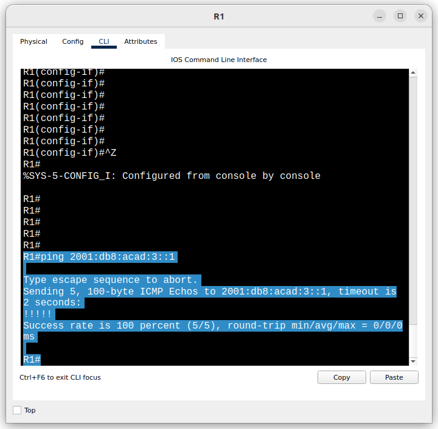

# Лабраторная работа - Настройка DHCPv6

## Топология

## Таблица адресации

|Устройство | Интерфейс | IPv6-адрес           |
|-----------|-----------|----------------------|
|R1         |G0/0/0     |2001:db8:acad:2::1/64 |
|           |           |fe80::1               |
|           |G0/0/1     |2001:db8:acad:1::1/64 |
|           |           |fe80::1               |
|R2         |G0/0/0     |2001:db8:acad:2::2/64 |
|           |           |fe80::2               |
|           |G0/0/1     |2001:db8:acad:3::1/64 |
|           |           |fe80::1               |
|PC-A       |NIC        |DHCP                  |
|PC-B       |NIC        |DHCP                  |

## Задачи

Часть 1. Создание сети и настройка основных параметров устройства
Часть 2. Проверка назначения адреса SLAAC от R1
Часть 3. Настройка и проверка сервера DHCPv6 без гражданства на R1
Часть 4. Настройка и проверка состояния DHCPv6 сервера на R1
Часть 5. Настройка и проверка DHCPv6 Relay на R2

### Решение

#### Часть 1. Создание сети и настройка основных параметров устройств

##### Шаг 1. Создание сети согласно топологии

Подключил устройства, как показано в топологии, и подсоединил необходимые кабели.

##### Шаг 2. Настройка базовых параметров каждого коммутатора

a. Присвоил коммутаторам имя устройства.
b. Отключил поиск DNS, чтобы предотвратить попытки маршрутизатора неверно преобразовывать введенные команды таким образом, как будто они являются именами узлов
c. Назначил class в качестве зашифрованного пароля привилегированного режима EXEC.
d. Назначил cisco в качестве пароля консоли и включите вход в систему по паролю.
e. Назначил cisco в качестве пароля VTY и включите вход в систему по паролю.
f. Зашифовал открытые пароли.
g. Отключил все неиспользуемые порты.
h. Скопировал текущую конфигурацию в файл загрузочной конфигурации.

##### Шаг 3. Базовая настройка маршрутизаторов

a. Присвоил маршрутизаторам имена **hostname R1**, **hostname R2**
b. Отключил поиск DNS командой **no ip domain-lookup**
c. Командой **enable secret class** установил зашифрованный пароль привилегированного режима EXEC.
d. Командами **line con 0 > password cisco > login** установил cisco в качестве пароля консоли и включил вход в систему по паролю.
e. Используя команды **line vty 0 4 > passord cisco > login** назначил пароль VTY и включил вход в систему по паролю.
f. Включил шифрование открытых паролей **service password-encryption**.
g. Активировал IPv6-маршрутизацию командой **ipv6 unicast-routing**
h. Сохранил текущую конфигурацию в качестве стартовой командой **copy run start**.

##### Шаг 4. Настройка интерфейсов и маршрутизации для обоих маршрутизаторов

a. Настроил интерфейсы G0/0/0 и G0/1 на R1 и R2 с адресами IPv6, указанными в таблице.

    R1(config)#int g0/0/1
    R1(config-if)#ipv6 add fe80::1 link-local
    R1(config-if)#ipv6 add 2001:db8:acad:1::1/64
    R1(config-if)#int g0/0/0
    R1(config-if)#ipv6 add fe80::1 link-local
    R1(config-if)#ipv6 add 2001:db8:acad:2::1/64

    R2(config)#int g0/0/0
    R2(config-if)#ipv6 address 2001:db8:acad:2::2/64
    R2(config-if)#ipv6 address fe80::2 link-local 
    R2(config)#int g0/0/1
    R2(config-if)#ipv6 address 2001:db8:acad:3::1/64
    R2(config-if)#ipv6 address fe80::1 link-local 

b. Настроил маршрут по умолчанию на каждом маршрутизаторе, который указывает на IP-адрес G0/0/0 на другом маршрутизаторе.

    R1(config)#ipv6 route ::1/64 2001:db8:acad:2::2
    R2(config)#ipv6 route ::1/64 2001:db8:acad:2::1

c. Убедился, что маршрутизация работает с помощью пинга адреса G0/0/1 R2 из R1.

d. Сохранил текущую конфигурацию в файл загрузочной конфигурации.

#### Часть 2. Проверка назначения адреса SLAAC от R1

Включил PC-A и переключил сетевой адаптер для автоматической настройки IPv6.
Увидел надпись *ipv6 request successful*
Используя команду **ipconfig** увидел, что PC-A присвоил себе адрес из сети 2001:db8:acad:1::/64.

    C:\>ipconfig

    FastEthernet0 Connection:(default port)

        Connection-specific DNS Suffix..: 
        Link-local IPv6 Address.........: FE80::2
        IPv6 Address....................: 2001:DB8:ACAD:1::2
        IPv4 Address....................: 0.0.0.0
        Subnet Mask.....................: 0.0.0.0
        Default Gateway.................: FE80::1
                                            0.0.0.0

**Откуда взялась часть адреса с идентификатором хоста?** Полагаю, что через ответ от R1 используя SLAAC

#### Часть 3. Настройка и проверка сервера DHCPv6 на R1

##### Шаг 1. Более подробно изучим конфигурацию PC-A

a. Выполнил команду **ipconfig /all**:

    C:\>ipconfig /all

    FastEthernet0 Connection:(default port)

        Connection-specific DNS Suffix..: 
        Physical Address................: 0002.4A14.4C08
        Link-local IPv6 Address.........: FE80::2
        IPv6 Address....................: 2001:DB8:ACAD:1::2
        IPv4 Address....................: 0.0.0.0
        Subnet Mask.....................: 0.0.0.0
        Default Gateway.................: FE80::1
                                            0.0.0.0
        DHCP Servers....................: 0.0.0.0
        DHCPv6 IAID.....................: 
        DHCPv6 Client DUID..............: 00-01-00-01-D9-C7-32-39-00-02-4A-14-4C-08
        DNS Servers.....................: ::
                                            0.0.0.0

b. Обратил внимание, что основной DNS-суффикс отсутствует. Также обратил внимание, что для ПК не предоставленны никакие адреса DNS-сервера.

##### Шаг 2. Настройка R1 для предоставления DHCPv6 без состояния для PC-A

a. Создал пул DHCP IPv6 на R1 с именем R1-STATELESS. В составе этого пула назначил адрес DNS-сервера 2001:db8:acad::1, а имя домена — stateless.com.

    R1(config)#ipv6 dhcp pool R1-STATELESS
    R1(config-dhcpv6)#dns-server 2001:db8:acad::254
    R1(config-dhcpv6)#domain-name stateless.com
    R1(config-dhcpv6)#

b. Настроил интерфейс G0/0/1 на R1, чтобы предоставить флаг конфигурации **OTHER** для локальной сети R1 и указал только что созданный пул DHCP в качестве ресурса DHCP для этого интерфейса.

    R1(config)#int g0/0/1
    R1(config-if)#ipv6 nd other-config-flag
    R1(config-if)#ipv6 dhcp server R1-STATELESS

c. Сохранил текущую конфигурацию в файл загрузочной конфигурации.
d. Перезапустил PC-A.
e. Проверил вывод **ipconfig /all** и обратил внимание на изменения: появился основной DNS-суффикс и для ПК теперь предоставленн адрес DNS-сервера.

    C:\>ipconfig /all

    FastEthernet0 Connection:(default port)

        Connection-specific DNS Suffix..: stateless.com 
        Physical Address................: 0002.4A14.4C08
        Link-local IPv6 Address.........: FE80::2
        IPv6 Address....................: 2001:DB8:ACAD:1::2
        IPv4 Address....................: 0.0.0.0
        Subnet Mask.....................: 0.0.0.0
        Default Gateway.................: FE80::1
                                            0.0.0.0
        DHCP Servers....................: 0.0.0.0
        DHCPv6 IAID.....................: 1506062924
        DHCPv6 Client DUID..............: 00-01-00-01-D9-C7-32-39-00-02-4A-14-4C-08
        DNS Servers.....................: 2001:DB8:ACAD::254
                                            0.0.0.0

i. Тестирование подключения с помощью пинга IP-адреса интерфейса G0/1 R2:

    C:\>ping 2001:db8:acad:3::1

    Pinging 2001:db8:acad:3::1 with 32 bytes of data:

    Reply from 2001:DB8:ACAD:3::1: bytes=32 time=1ms TTL=254
    Reply from 2001:DB8:ACAD:3::1: bytes=32 time<1ms TTL=254
    Reply from 2001:DB8:ACAD:3::1: bytes=32 time<1ms TTL=254
    Reply from 2001:DB8:ACAD:3::1: bytes=32 time<1ms TTL=254

    Ping statistics for 2001:DB8:ACAD:3::1:
        Packets: Sent = 4, Received = 4, Lost = 0 (0% loss),
    Approximate round trip times in milli-seconds:
        Minimum = 0ms, Maximum = 1ms, Average = 0ms

#### Часть 4. Настройка сервера DHCPv6 с сохранением состояния на R1

a. Создал пул DHCPv6 на R1 для сети 2001:db8:acad:3:aaa::/80. Это предоставит адреса локальной сети, подключенной к интерфейсу G0/0/1 на R2. В составе пула задайте DNS-сервер 2001:db8:acad::254 и задайте доменное имя STATEFUL.com

    R1(config)#ipv6 dhcp pool R2-STATEFUL
    R1(config-dhcpv6)#address prefix 2001:db8:acad:3:aaa::/80
    R1(config-dhcpv6)#dns-server 2001:db8:acad::254
    R1(config-dhcpv6)#domain-name stateful.com

b. Назначил только что созданный пул DHCPv6 интерфейсу g0/0/0 на R1

    R1(config)#interface g0/0/0
    R1(config-if)#ipv6 dhcp server R2-STATEFUL

#### Часть 5. Настройка и проверка ретрансляции DHCPv6 на R2

##### Шаг 1. Включиение PC-B и проверка адреса SLAAC, который он генерирует

    C:\>ipconfig /all

    FastEthernet0 Connection:(default port)

        Connection-specific DNS Suffix..: 
        Physical Address................: 000B.BE07.B7A4
        Link-local IPv6 Address.........: FE80::20B:BEFF:FE07:B7A4
        IPv6 Address....................: 2001:DB8:ACAD:3:20B:BEFF:FE07:B7A4
        IPv4 Address....................: 0.0.0.0
        Subnet Mask.....................: 0.0.0.0
        Default Gateway.................: FE80::1
                                            0.0.0.0
        DHCP Servers....................: 0.0.0.0
        DHCPv6 IAID.....................: 
        DHCPv6 Client DUID..............: 00-01-00-01-CC-E4-A3-7C-00-0B-BE-07-B7-A4
        DNS Servers.....................: ::
                                            0.0.0.0

Обратил внимание на вывод, что используется префикс 2001:db8:acad:3::

##### Шаг 2. Настройка R2 в качестве агента DHCP-ретрансляции для локальной сети на G0/0/1

a. Настроил команду команду **managed-config-flag** на интерфейсе R2 G0/0/1. Настроить команду **ipv6 dhcp relay** указав адрес назначения интерфейса G0/0/0 на R1 не получилось.

    R2(config)#int g0/0/1
    R2(config-if)#ipv6 nd managed-config-flag
    R2(config-if)#ipv6 dhcp relay destination 2001:db8:acad:2::1 g0/0/0
                            ^
    % Invalid input detected at '^' marker.

b. Сохранил конфигурацию

##### Шаг 3. Попытка получить адрес IPv6 из DHCPv6 на PC-B

a. Перезапустил PC-B.
b. Открыл командную строку на PC-B, выполнил команду **ipconfig /all** и проверил выходные данные, чтобы увидеть результаты операции ретрансляции DHCPv6.

    C:\>ipconfig /all

    FastEthernet0 Connection:(default port)

        Connection-specific DNS Suffix..: 
        Physical Address................: 000B.BE07.B7A4
        Link-local IPv6 Address.........: FE80::20B:BEFF:FE07:B7A4
        IPv6 Address....................: ::
        IPv4 Address....................: 0.0.0.0
        Subnet Mask.....................: 0.0.0.0
        Default Gateway.................: FE80::1
                                            0.0.0.0
        DHCP Servers....................: 0.0.0.0
        DHCPv6 IAID.....................: 324832581
        DHCPv6 Client DUID..............: 00-01-00-01-CC-E4-A3-7C-00-0B-BE-07-B7-A4
        DNS Servers.....................: ::
                                            0.0.0.0

Адреса и DNS сервера ожидаемо не увидел. Полагаю, что эьто связано с ограничениями CiscoPacketTracer.

c. Откатил настройки маршрутизатора R2 и проверил подключение с помощью пинга IP-адреса интерфейса R0 G0/0/1.

    C:\>ping 2001:db8:acad:1::1

    Pinging 2001:db8:acad:1::1 with 32 bytes of data:

    Reply from 2001:DB8:ACAD:1::1: bytes=32 time<1ms TTL=254
    Reply from 2001:DB8:ACAD:1::1: bytes=32 time=12ms TTL=254
    Reply from 2001:DB8:ACAD:1::1: bytes=32 time<1ms TTL=254
    Reply from 2001:DB8:ACAD:1::1: bytes=32 time=1ms TTL=254

    Ping statistics for 2001:DB8:ACAD:1::1:
        Packets: Sent = 4, Received = 4, Lost = 0 (0% loss),
    Approximate round trip times in milli-seconds:
        Minimum = 0ms, Maximum = 12ms, Average = 3ms