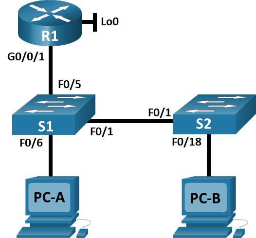
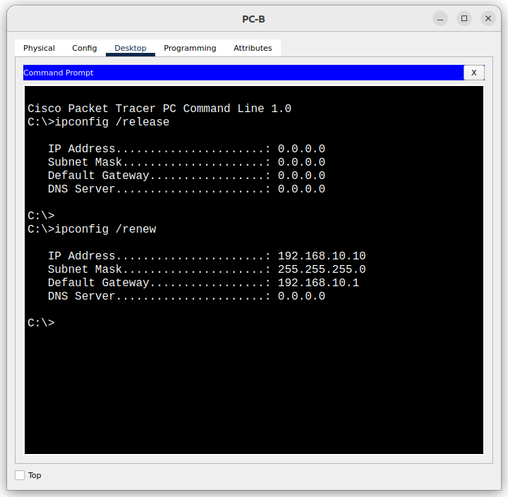
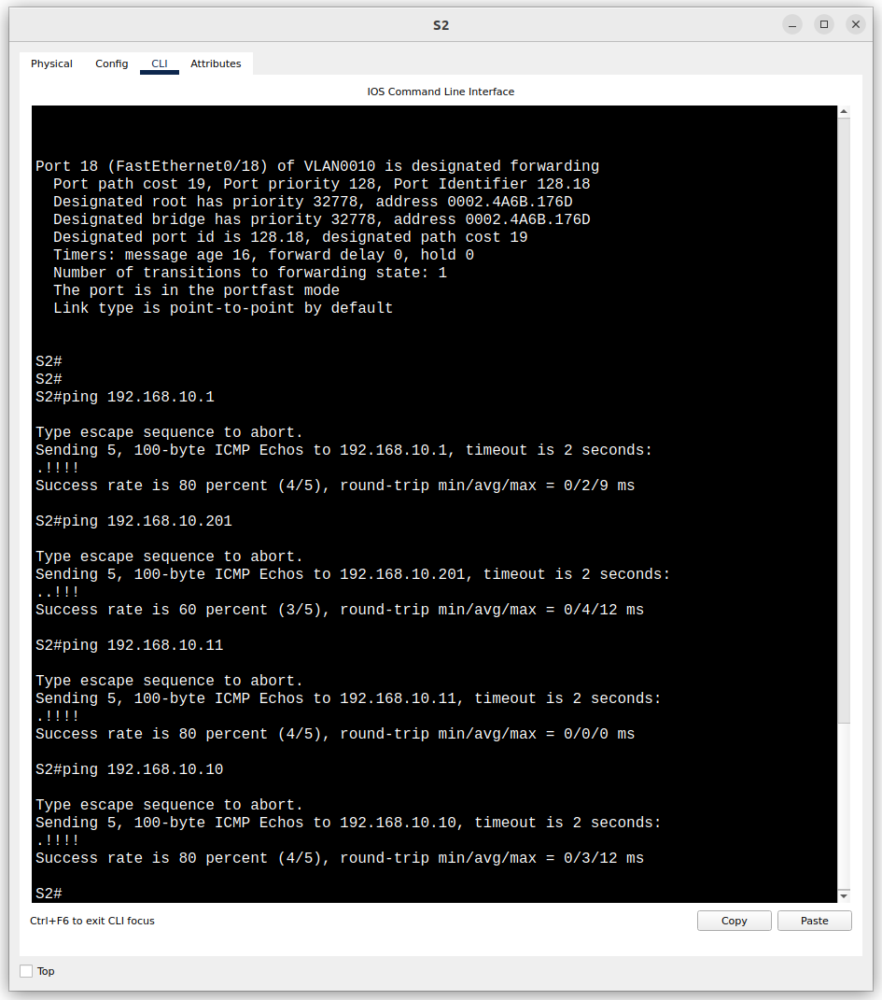
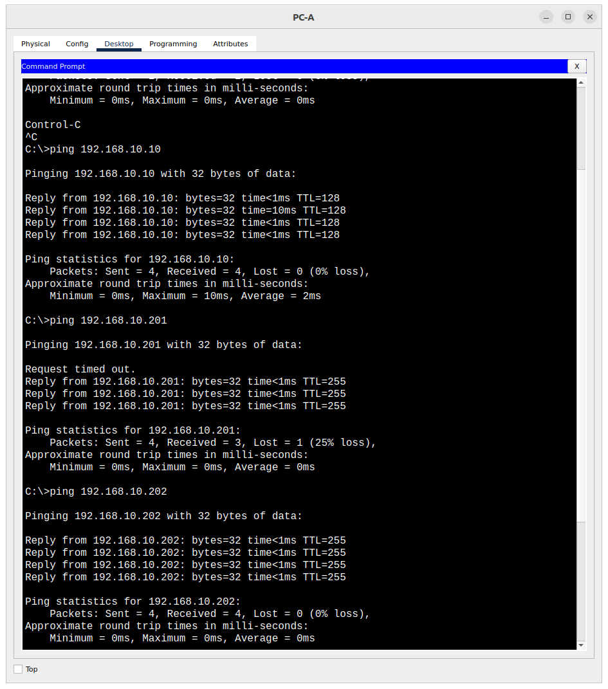
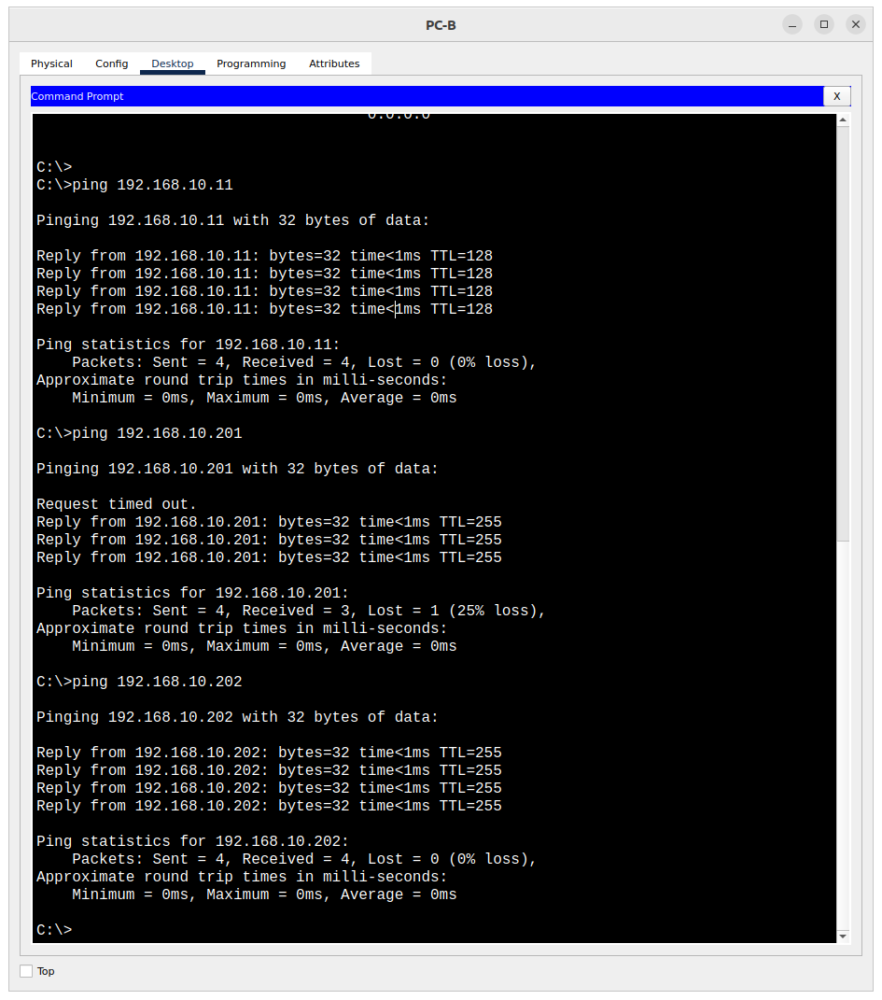

# Лабораторная работа - Конфигурация безопасности коммутатора

## Топология

## Таблица адресации

|Устройство | Интерфейс | IP-адрес       | Маска подсети   |
|-----------|-----------|----------------|-----------------|
|R1         |G0/0/0     |192.168.10.1    | 255.255.255.0   |
|           |Loopback 0 |10.10.1.1       | 255.255.255.0   |
|S1         |VLAN 10    |192.168.10.201  | 255.255.255.0   |
|S2         |VLAN 10    |192.168.10.202  | 255.255.255.0   |
|PC-A       |NIC        |DHCP            | 255.255.255.0   |
|PC-B       |NIC        |DHCP            | 255.255.255.0   |

## Цели

Часть 1. Настройка основного сетевого устройства
Часть 2. Настройка сетей VLAN
Часть 3: Настройки безопасности коммутатора.

### Решение

#### Часть 1. Настройка основного сетевого устройства

##### Шаг 1. Создание сети

a. Создал сеть согласно топологии.

##### Шаг 2. Настройка маршрутизатор R1

a. Загрузил следующий конфигурационный скрипт на **R1**:

    enable
    configure terminal
    hostname R1
    no ip domain lookup
    ip dhcp excluded-address 192.168.10.1 192.168.10.9
    ip dhcp excluded-address 192.168.10.201 192.168.10.202
    !
    ip dhcp pool Students
    network 192.168.10.0 255.255.255.0
    default-router 192.168.10.1
    domain-name CCNA2.Lab-11.6.1
    !
    interface Loopback0
    ip address 10.10.1.1 255.255.255.0
    !
    interface GigabitEthernet0/0/1
    description Link to S1
    ip dhcp relay information trusted
    ip address 192.168.10.1 255.255.255.0
    no shutdown
    !
    line con 0
    logging synchronous
    exec-timeout 0 0

b. Проверил текущую конфигурацию на R1, используя следующую команду

    R1# show ip interface brief
    Interface IP-Address OK? Method Status Protocol
    GigabitEthernet0/0/0 unassigned YES NVRAM administratively down down
    GigabitEthernet0/0/1 192.168.10.1 YES manual up down
    Loopback0 10.10.1.1 YES manual up up
    Vlan1 unassigned YES unset administratively down down

c. Убедился, что IP-адресация и интерфейсы находятся в состоянии up/up.

##### Шаг 3. Настройка и проверка основных параметров коммутаторов

a. Настроил имя хоста для коммутаторов S1 и S2.
b. Запретил нежелательный поиск в DNS.
c. Далее произвёл базовую настройку коммутаторов.

#### Часть 2. Настройка сетей VLAN на коммутаторах

##### Шаг 1. Сконфигруриуем VLAN 10

Добавил VLAN 10 на **S1** и **S2** и назвал VLAN - *Management*.

    S1(config)#vlan 10
    S1(config-vlan)#name Management

**Здесь и далее приведены настройки коммутатора S1, т.к. для второго коммутатора настройки в целом одинаковы.**

##### Шаг 2. Сконфигруриуем SVI для VLAN 10

Настроил IP-адрес в соответствии с таблицей адресации для SVI для VLAN 10 на S1 и S2. Включил интерфейсы SVI и ввёл описание для интерфейса.

    S1(config)#interface vlan 10
    S1(config-if)#ip address 192.168.10.201 255.255.255.0
    S1(config-if)#no shutdown
    S1(config-if)#description Management_vlan
    S1(config)#ip default-gateway 192.168.10.1

    S1(config)#int fa0/1
    S1(config-if)#description link_2_S2
    S1(config-if)#int fa0/5
    S1(config-if)#description link_2_R1
    S1(config-if)#int fa0/6
    S1(config-if)#description link_2_PC-A

##### Шаг 3. Настройка VLAN 333 с именем Native на S1 и S2

    S1(config)#vlan 333
    S1(config-vlan)#name Native

##### Шаг 4. Настройка VLAN 999 с именем Parking на S1 и S2

    S1(config-vlan)#vlan 999
    S1(config-vlan)#name Parking

#### Часть 3. Настройки безопасности коммутатора

##### Шаг 1. Релизация магистральных соединений 802.1Q

a. Настроил все магистральные порты Fa0/1 на обоих коммутаторах для использования VLAN 333 в качестве native VLAN.

    S1(config)#int fa0/1
    S1(config-if)#sw mo trunk
    S1(config-if)#sw tr nat vl 333

b. Убедился, что режим транкинга успешно настроен на всех коммутаторах.

    S1#sh interface trunk
    Port        Mode         Encapsulation  Status        Native vlan
    Fa0/1       on           802.1q         trunking      333

    Port        Vlans allowed on trunk
    Fa0/1       1-1005

    Port        Vlans allowed and active in management domain
    Fa0/1       1,10,333,999

    Port        Vlans in spanning tree forwarding state and not pruned
    Fa0/1       1,10,333,999

    S2#show interface trunk
    Port        Mode         Encapsulation  Status        Native vlan
    Fa0/1       on           802.1q         trunking      333

    Port        Vlans allowed on trunk
    Fa0/1       1-1005

    Port        Vlans allowed and active in management domain
    Fa0/1       1,10,333,999

    Port        Vlans in spanning tree forwarding state and not pruned
    Fa0/1       1,10,333,999

c. Отключил согласование DTP F0/1 на S1 и S2.

    S1(config-if)#switchport nonegotiate

    S1#show interfaces f0/1 switchport | include Negotiation
      Negotiation of Trunking: Off

    S2#show interfaces f0/1 switchport | include Negotiation
      Negotiation of Trunking: Off

##### Шаг 2. Настройка портов доступа

a. На **S1** настроил F0/5 и F0/6 в качестве портов доступа и связал их с VLAN 10.

    S1(config-if)#int range fa0/5-6
    S1(config-if)#switchport mode access
    S1(config-if)#switchport access vlan 10

b. На **S2** настроил порт доступа Fa0/18 и связал его с VLAN 10.

    S2(config-if)#int fa0/18
    S2(config-if)#switchport mode access
    S2(config-if)#switchport access vlan 10

##### Шаг 3. Безопасность неиспользуемых портов коммутатора

a. На **S1** и **S2** переместил неиспользуемые порты из VLAN 1 в VLAN 999 и отключил неиспользуемые порты.

    S1(config)#int range f0/2-4,fa0/7-24,g0/1-2
    S1(config-if-range)#shutdown
    S1(config-if-range)#description NO_USE
    S1(config-if-range)#sw mo access
    S1(config-if-range)#sw access vlan 999

b. Убедился, что неиспользуемые порты отключены и связаны с VLAN 999, введя команду **show interfaces status**

    S1#show interfaces status
    Port      Name               Status       Vlan       Duplex  Speed Type
    Fa0/1     link_2_S2          connected    trunk      auto    auto  10/100BaseTX
    Fa0/2     NO_USE             disabled 999        auto    auto  10/100BaseTX
    Fa0/3     NO_USE             disabled 999        auto    auto  10/100BaseTX
    Fa0/4     NO_USE             disabled 999        auto    auto  10/100BaseTX
    Fa0/5     link_2_R1          connected    10         auto    auto  10/100BaseTX
    Fa0/6     link_2_PC-A        connected    10         auto    auto  10/100BaseTX
    Fa0/7     NO_USE             disabled 999        auto    auto  10/100BaseTX
      < output omitted >

    S2#sh interfaces status
    Port      Name               Status       Vlan       Duplex  Speed Type
    Fa0/1     link_2_S1          connected    trunk      auto    auto  10/100BaseTX
    Fa0/2     NO_USE             disabled 999        auto    auto  10/100BaseTX
      < output omitted >
    Fa0/16    NO_USE             disabled 999        auto    auto  10/100BaseTX
    Fa0/17    NO_USE             disabled 999        auto    auto  10/100BaseTX
    Fa0/18    link_2_PC-B        connected    10         auto    auto  10/100BaseTX
    Fa0/19    NO_USE             disabled 999        auto    auto  10/100BaseTX
    Fa0/20    NO_USE             disabled 999        auto    auto  10/100BaseTX
    Fa0/21    NO_USE             disabled 999        auto    auto  10/100BaseTX
    Fa0/22    NO_USE             disabled 999        auto    auto  10/100BaseTX
    Fa0/23    NO_USE             disabled 999        auto    auto  10/100BaseTX
    Fa0/24    NO_USE             disabled 999        auto    auto  10/100BaseTX
    Gig0/1    NO_USE             disabled 999        auto    auto  10/100BaseTX
    Gig0/2    NO_USE             disabled 999        auto    auto  10/100BaseTX

##### Шаг 4. Документирование и реализация функций безопасности порта

a. На **S1**, ввел команду **show port-security interface f0/6** для отображения настроек по умолчанию безопасности порта для интерфейса F0/6.

**Конфигурация безопасности порта по умолчанию:**
| Функция | Настройка по умолчанию |
|---------|------------------------|
|Защита портов| Disabled (отключена)|
|Максимальное количество записей MAC-адресов | 1 |
|Режим проверки на нарушение безопасности | Shutdown (отключение по ошибке) |
|Aging Time | 0 мин |
|Aging Type | Absolute |
|Secure Static Address Aging | Disabled |
|Sticky MAC Address | 0 |

b. На **S1** включил защиту порта на F0 / 6 со следующими настройками:

- Максимальное количество записей MAC-адресов: **3**
- Режим безопасности: **restrict**
- Aging time: **60 мин**.
- Aging type: **неактивный**

Команды:

    S1(config)#int fa0/6
    S1(config-if)#sw port-security
    S1(config-if)#switchport port-security maximum 3
    S1(config-if)#switchport port-security violation restrict
    S1(config-if)#switchport port-security aging time 60

c. Проверил настройки безопасности порта F0/6 на **S1**:

    S1#show port-security interface f0/6
    Port Security              : Enabled
    Port Status                : Secure-up
    Violation Mode             : Restrict
    Aging Time                 : 60 mins
    Aging Type                 : Absolute
    SecureStatic Address Aging : Disabled
    Maximum MAC Addresses      : 3
    Total MAC Addresses        : 1
    Configured MAC Addresses   : 0
    Sticky MAC Addresses       : 0
    Last Source Address:Vlan   : 00E0.A342.C6C5:10
    Security Violation Count   : 0

    S1#show port-security address
            Secure Mac Address Table
    -----------------------------------------------------------------------------
    Vlan    Mac Address       Type                          Ports   Remaining Age
                                                                    (mins)
    10 00E0.A342.C6C5 DynamicConfigured FastEthernet0/6  -

    Total Addresses in System (excluding one mac per port)     : 0
    Max Addresses limit in System (excluding one mac per port) : 1024

d. Включил безопасность порта для F0/18 на **S2**. Настроил активный порт доступа таким образом, чтобы он автоматически добавлял адреса МАС, изученные на этом порту, в текущую конфигурацию.

    S2(config)#int fa0/18
    S2(config-if)#switchport port-security
    S2(config-if)#switchport port-security mac-address sticky

e. Настроил следующие параметры безопасности порта на **S2** F/18:

- Максимальное количество записей MAC-адресов: 2
- Тип безопасности: Protect
- Aging time: 60 мин.

Команды:

    S2(config-if)#sw port-security maximum 2
    S2(config-if)#sw port-security violation protect
    S2(config-if)#sw port-security aging time 60

f. Проверка функции безопасности портов на **S2** F0/18:

    S2#show port-security interface f0/18
    Port Security              : Enabled
    Port Status                : Secure-up
    Violation Mode             : Protect
    Aging Time                 : 60 mins
    Aging Type                 : Absolute
    SecureStatic Address Aging : Disabled
    Maximum MAC Addresses      : 2
    Total MAC Addresses        : 1
    Configured MAC Addresses   : 0
    Sticky MAC Addresses       : 0
    Last Source Address:Vlan   : 0030.A39D.6C62:10
    Security Violation Count   : 0

    S2#show port-security address
                Secure Mac Address Table
    -----------------------------------------------------------------------------
    Vlan    Mac Address       Type                          Ports   Remaining Age
                                                                    (mins)

    10    0030.A39D.6C62    SecureSticky                  Fa0/18       -

##### Шаг 5. Реализация безопасности DHCP snooping

a. На **S2** включил *DHCP snooping* и настроил DHCP snooping в VLAN 10:

    S2(config)#ip dhcp snooping
    S2(config)#ip dhcp snooping vlan 10

b. Настроил магистральный порт на **S2** как доверенный порт:

    S2(config)#int fa0/1
    S2(config-if)#ip dhcp snooping trust

c. Ограничил ненадежный порт Fa0/18 на **S2** пятью DHCP-пакетами в секунду:

    S2(config-if)#int f0/18
    S2(config-if)#ip dhcp snooping limit rate 5

d. Проверил DHCP Snooping на S2:

    S2#sh ip dhcp snooping
        Switch DHCP snooping is enabled
        DHCP snooping is configured on following VLANs:
        10
        Insertion of option 82 is disabled
        Option 82 on untrusted port is not allowed
        Verification of hwaddr field is enabled
        Interface                  Trusted    Rate limit (pps)
        -----------------------    -------    ----------------
        FastEthernet0/1            yes        unlimited
        FastEthernet0/18           no         5

e. В командной строке на PC-B освободил, а затем обновил IP-адрес:

    C:\Users\Student> ipconfig /release
    C:\Users\Student> ipconfig /renew

f. Проверил привязку отслеживания DHCP с помощью команды **show ip dhcp snooping binding**:

    S2#sh ip dhcp snooping binding
    MacAddress          IpAddress        Lease(sec)  Type           VLAN  Interface
    ------------------  ---------------  ----------  -------------  ----  -----------------
    00:30:A3:9D:6C:62   192.168.10.10    0           dhcp-snooping  10    FastEthernet0/18
    Total number of bindings: 1

##### Шаг 6. Реализация PortFast и BPDU Guard

a. Настроил **PortFast** на всех портах доступа, которые используются на обоих коммутаторах:

    S1(config)#int f0/6
    %Warning: portfast should only be enabled on ports connected to a single
    host. Connecting hubs, concentrators, switches, bridges, etc... to this
    interface  when portfast is enabled, can cause temporary bridging loops.
    Use with CAUTION

    %Portfast has been configured on FastEthernet0/6 but will only
    have effect when the interface is in a non-trunking mode.

b. Включил защиту BPDU на портах доступа VLAN 10 S1 и S2, подключенных к PC-A и PC-B.

    S1(config)# interface f0/6
    S1(config-if)# spanning-tree bpduguard enable

    S2(config)# interface f0/18
    S2(config-if)# spanning-tree bpduguard enable

c. Убедился, что защита BPDU и PortFast включены на соответствующих портах:

    S1#show spanning-tree interface f0/6 detail

    Port 6 (FastEthernet0/6) of VLAN0010 is designated forwarding
    Port path cost 19, Port priority 128, Port Identifier 128.6
    Designated root has priority 32778, address 0002.4A6B.176D
    Designated bridge has priority 32778, address 0030.A3BB.E820
    Designated port id is 128.6, designated path cost 19
    Timers: message age 16, forward delay 0, hold 0
    Number of transitions to forwarding state: 1
    The port is in the portfast mode
    Link type is point-to-point by default

    S2#sh spanning-tree interface fa0/18 detail
    
    Port 18 (FastEthernet0/18) of VLAN0010 is designated forwarding
    Port path cost 19, Port priority 128, Port Identifier 128.18
    Designated root has priority 32778, address 0002.4A6B.176D
    Designated bridge has priority 32778, address 0002.4A6B.176D
    Designated port id is 128.18, designated path cost 19
    Timers: message age 16, forward delay 0, hold 0
    Number of transitions to forwarding state: 1
    The port is in the portfast mode
    Link type is point-to-point by default

##### Шаг 7. Проверка наличия сквозного подключения

Проверил **PING** свзяь между всеми устройствами в таблице IP-адресации:

**Вопросы для повторения:**

1. С точки зрения безопасности порта на S2, почему нет значения таймера для оставшегося возраста в минутах, когда было сконфигурировано динамическое обучение - **sticky**?
*Когда настроено sticky learning, коммутатор запоминает MAC-адреса устройств, подключенных к защищенным портам, и сохраняет их в текущей конфигурации. Для них не используется таймер оставшегося времени. Он используется в контексте устаревания динамически запоминаемых MAC-адресов.*

2. Что касается безопасности порта на S2, если вы загружаете скрипт текущей конфигурации на S2, почему порту 18 на PC-B никогда не получит IP-адрес через DHCP?
*Не совсем понял вопроса. Я проверил загрузку текущей конфигурации на "чистый" коммутатор с подключенным в порт 18 ПК. И ПК спокойно получил IP-адрес через DHCP. Возможен вариант, когда будет произведена замена 2х ПК, подключенных к этому порту. Тогда в текущую конфигурацию запишется два адреса, а на третий "места" не будет и он будет заблокирован. А т.к. включен режим "protect", то порт отбрасывает пакеты с неизвестными адресами источника MAC, пока мы не удалим достаточное количество защищенных адресов MAC, чтобы опуститься ниже максимального значения или увеличим максимальное значение. Так же не будет сообщений системного журнала (syslog) и увеличения счётчика*

3. Что касается безопасности порта, в чем разница между типом абсолютного устаревания и типом устаревание по неактивности?
*Если задано "устаревание по неактивности" (**type inactivity**), то защищенные адреса на порту будут удалены только в том случае, если трафик данных с защищенных адресов-источников не будет поступать в течение указанного периода времени. Если задан тип "абсолютного устаревания" (**type absolute**), то все защищенные адреса на этом порту будут отключены точно по истечении указанного времени.*
