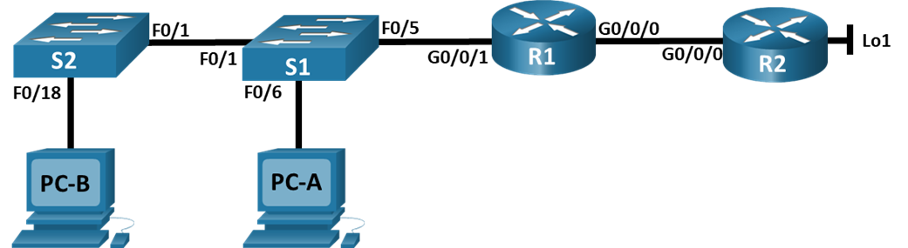

# Лабораторная работа - Настройка NAT для IPv4

## Топология

## Таблица адресации

|Устройство | Интерфейс | IP-адрес          | Маска подсети   |
|-----------|-----------|-------------------|-----------------|
|R1         |G0/0/0     |209.165.200.230    | 255.255.255.248 |
|           |G0/0/1     |192.168.1.1        | 255.255.255.0   |
|R2         |G0/0/0     |209.165.200.225    | 255.255.255.248 |
|           |Lo1        |209.165.200.1      | 255.255.255.224 |
|S1         |VLAN 1     |192.168.1.11       | 255.255.255.0   |
|S2         |VLAN 1     |192.168.1.12       | 255.255.255.0   |
|PC-A       |NIC        |192.168.1.2        | 255.255.255.0   |
|PC-B       |NIC        |192.168.1.3        | 255.255.255.0   |

## Цели

Часть 1. Создание сети и настройка основных параметров устройства
Часть 2. Настройка и проверка NAT для IPv4
Часть 3. Настройка и проверка PAT для IPv4
Часть 4. Настройка и проверка статического NAT для IPv4.

### Решение

#### Часть 1. Создание сети и настройка основных параметров устройств

##### Шаг 1. Создание сети

a. Создал сеть согласно топологии.

##### Шаг 2. Настройка и проверка основных параметров маршрутизаторов

     a. Назначил маршрутизаторам имя устройства.
     b. Отключил поиск DNS, чтобы предотвратить попытки маршрутизатора неверно преобразовывать введенные команды таким образом, как будто они являются именами узлов.
     c. Назначил class в качестве зашифрованного пароля привилегированного режима EXEC.
     d. Назначил cisco в качестве пароля консоли и включите вход в систему по паролю.
     e. Назначил cisco в качестве пароля VTY и включите вход в систему по паролю.
     f. Включил шифрование открытых паролей.
     g. Настроил IP-адресации интерфейсов, как указано в таблице выше.
     h. Настроил маршрут по умолчанию. от R2 до  R1.
     i. Сохранил текущую конфигурацию в файл загрузочной конфигурации.

##### Шаг 3. Настройка и проверка основных параметров коммутаторов

     a. Назначил маршрутизатору имя устройства.
     b. Отключил поиск DNS, чтобы предотвратить попытки маршрутизатора неверно преобразовывать введенные команды таким образом, как будто они являются именами узлов.
     c. Назначил class в качестве зашифрованного пароля привилегированного режима EXEC.
     d. Назначил cisco в качестве пароля консоли и включите вход в систему по паролю.
     e. Назначил cisco в качестве пароля VTY и включите вход в систему по паролю.
     f. Включил шифрование открытых паролей.
     g. Выключил все интерфейсы, которые не будут использоваться
     h. Настроил IP-адресацию интерфейса, как указано в таблице выше.
     i. Сохранил текущую конфигурацию в файл загрузочной конфигурации.

#### Часть 2. Настройка и проверка NAT для IPv4

##### Шаг 1. Настройка NAT на R1, используя пул из трех адресов 209.165.200.226-209.165.200.228

a. Настроил простой список доступа, который определяет, какие хосты будут разрешены для трансляции. В этом случае все устройства в локальной сети R1 имеют право на трансляцию.

     R1(config)# access-list 1 permit 192.168.1.0 0.0.0.255 

b. Создал пул NAT и укажите ему имя и диапазон используемых адресов.

     R1(config)# ip nat pool PUBLIC_ACCESS 209.165.200.226 209.165.200.228 netmask 255.255.255.248 

c. Настроил перевод, связывая ACL и пул с процессом преобразования.

     R1(config)# ip nat inside source list 1 pool PUBLIC_ACCESS 

d. Задал внутренний (inside) интерфейс.

     R1(config)# interface g0/0/1
     R1(config-if)# ip nat inside

e. Определил внешний (outside) интерфейс.

     R1(config)# interface g0/0/0
     R1(config-if)# ip nat outside

##### Шаг 2. Проверка конфигурации

a. С **PC-B**, запустил эхо-запрос интерфейса **Lo1** (209.165.200.1) на **R2**. На **R1** проверил таблицу NAT с помощью команды **show ip nat translations**.

     R1#sh ip nat tr
     Pro  Inside global       Inside local       Outside local      Outside global
     icmp 209.165.200.227:389 192.168.1.3:389    209.165.200.1:389  209.165.200.1:389
     icmp 209.165.200.227:390 192.168.1.3:390    209.165.200.1:390  209.165.200.1:390
     icmp 209.165.200.227:391 192.168.1.3:391    209.165.200.1:391  209.165.200.1:391
     icmp 209.165.200.227:392 192.168.1.3:392    209.165.200.1:392  209.165.200.1:392

**Вопросы:**
**Во что был транслирован внутренний локальный адрес PC-B?** Внутренний локальный адрес (Inside local) был транслирован во **внутренний глобальный адрес** (**Inside global**). **192.168.1.3** был транслирован в **209.165.200.227**

**Какой тип адреса NAT является переведенным адресом?** Внутренний глобальный адрес

b. С **PC-A**, запустил эхо-запрос интерфейса **Lo1** (209.165.200.1) на **R2**. На **R1** проверил таблицу NAT с помощью команды **show ip nat translations**.

     R1#sh ip nat tr
     Pro  Inside global       Inside local       Outside local      Outside global
     icmp 209.165.200.226:45  192.168.1.2:45     209.165.200.1:45   209.165.200.1:45
     icmp 209.165.200.226:46  192.168.1.2:46     209.165.200.1:46   209.165.200.1:46
     icmp 209.165.200.226:47  192.168.1.2:47     209.165.200.1:47   209.165.200.1:47
     icmp 209.165.200.226:48  192.168.1.2:48     209.165.200.1:48   209.165.200.1:48
     icmp 209.165.200.228:393 192.168.1.3:393    209.165.200.1:393  209.165.200.1:393
     icmp 209.165.200.228:394 192.168.1.3:394    209.165.200.1:394  209.165.200.1:394
     icmp 209.165.200.228:395 192.168.1.3:395    209.165.200.1:395  209.165.200.1:395
     icmp 209.165.200.228:396 192.168.1.3:396    209.165.200.1:396  209.165.200.1:396

c. Обратил внимание, что предыдущая трансляция для **PC-B** все еще находится в таблице. Из **S1** запустил эхо-запрос интерфейса **Lo1** (209.165.200.1) на **R2**. На **R1** проверил таблицу NAT.

     R1# show ip nat translations
     Pro  Inside global       Inside local       Outside local      Outside global
     icmp 209.165.200.226:45  192.168.1.2:45     209.165.200.1:45   209.165.200.1:45
     icmp 209.165.200.226:46  192.168.1.2:46     209.165.200.1:46   209.165.200.1:46
     icmp 209.165.200.226:47  192.168.1.2:47     209.165.200.1:47   209.165.200.1:47
     icmp 209.165.200.226:48  192.168.1.2:48     209.165.200.1:48   209.165.200.1:48
     icmp 209.165.200.227:2   192.168.1.11:2     209.165.200.1:2    209.165.200.1:2
     icmp 209.165.200.227:3   192.168.1.11:3     209.165.200.1:3    209.165.200.1:3
     icmp 209.165.200.227:4   192.168.1.11:4     209.165.200.1:4    209.165.200.1:4
     icmp 209.165.200.227:5   192.168.1.11:5     209.165.200.1:5    209.165.200.1:5
     icmp 209.165.200.228:393 192.168.1.3:393    209.165.200.1:393  209.165.200.1:393
     icmp 209.165.200.228:394 192.168.1.3:394    209.165.200.1:394  209.165.200.1:394
     icmp 209.165.200.228:395 192.168.1.3:395    209.165.200.1:395  209.165.200.1:395
     icmp 209.165.200.228:396 192.168.1.3:396    209.165.200.1:396  209.165.200.1:396

d. После этого попробовал запустить пинг интерфейса **Lo1** **R2** с коммутатора **S2**. Пинг не прошёл и, к сожалению на R1 не вывелось никакой информации об ошибке.

e. Полагаю. что в любом случае это ожидаемый результат, потому что выделено только **3** адреса, и мы попытались ping Lo1 с четырех устройств. А **NAT** — это трансляция «один-в-один».
Узнать как много выделено трансляций можно введя команду **show ip nat translations verbose**, и в выводе, вероятно, можно увидеть, что ответ будет 3. Но в эмуляторе не работает данная команда.

     R1# show ip nat translations verbose 

Проверил пинг интерфейса **Lo1** **R2** с коммутатора **S2** очистив трансляции.

     R1#sh ip nat tr
     Pro  Inside global       Inside local       Outside local      Outside global
     icmp 209.165.200.226:11  192.168.1.12:11    209.165.200.1:11   209.165.200.1:11
     icmp 209.165.200.226:12  192.168.1.12:12    209.165.200.1:12   209.165.200.1:12
     icmp 209.165.200.226:13  192.168.1.12:13    209.165.200.1:13   209.165.200.1:13
     icmp 209.165.200.226:14  192.168.1.12:14    209.165.200.1:14   209.165.200.1:14
     icmp 209.165.200.226:15  192.168.1.12:15    209.165.200.1:15   209.165.200.1:15

Всё работает!!!

f. Учитывая, что пул ограничен тремя адресами, NAT для пула адресов недостаточно для нашего приложения. Очистил преобразование NAT и статистику, и перешел к **PAT**.

     R1# clear ip nat translation *

#### Часть 3. Настройка и проверка PAT для IPv4

##### Шаг 1. Удалите команду преобразования на R1

Чтобы начать работу в части 3, удалим команду, связывающую **ACL** и **POOL** вместе.

     R1(config)# no ip nat inside source list 1 pool PUBLIC_ACCESS 

##### Шаг 2. Добавим команду PAT на R1

Теперь настроим преобразование ***PAT*** в пул адресов. Так как ACL и Pool уже настроены, то единственная команда, которую нам нужно изменить с NAT на PAT:

     R1(config)# ip nat inside source list 1 pool PUBLIC_ACCESS overload

##### Шаг 3. Протестируем и проверим конфигурацию

a. Проверим, что **PAT** работает. С **PC-B**,  запустил эхо-запрос интерфейса **Lo1** (209.165.200.1) на **R2**. На **R1** отобразил таблицу **NAT** с помощью команды **show ip nat translations**.

     R1#sh ip nat translations 
     Pro  Inside global     Inside local       Outside local      Outside global
     icmp 209.165.200.227:5 192.168.1.3:5      209.165.200.1:5    209.165.200.1:5
     icmp 209.165.200.227:6 192.168.1.3:6      209.165.200.1:6    209.165.200.1:6
     icmp 209.165.200.227:7 192.168.1.3:7      209.165.200.1:7    209.165.200.1:7
     icmp 209.165.200.227:8 192.168.1.3:8      209.165.200.1:8    209.165.200.1:8

**Во что был транслирован внутренний локальный адрес PC-B?** Внутренний локальный адрес (Inside local) был транслирован во **внутренний глобальный адрес** (**Inside global**). **192.168.1.3** был транслирован в **209.165.200.226**
**Какой тип адреса NAT является переведенным адресом?** Внутренний глобальный адрес
**Чем отличаются выходные данные команды show ip nat translations из упражнения NAT?** Ничем.

b. С **PC-A**, запустил эхо-запрос интерфейса **Lo1** (209.165.200.1) на **R2**. На **R1** отобразил таблицу **NAT** с помощью команды **show ip nat translations**.

     R1#sh ip nat tr
     Pro  Inside global       Inside local       Outside local      Outside global
     icmp 209.165.200.227:10  192.168.1.2:10     209.165.200.1:10   209.165.200.1:10
     icmp 209.165.200.227:11  192.168.1.2:11     209.165.200.1:11   209.165.200.1:11
     icmp 209.165.200.227:12  192.168.1.2:12     209.165.200.1:12   209.165.200.1:12
     icmp 209.165.200.227:5   192.168.1.3:5      209.165.200.1:5    209.165.200.1:5
     icmp 209.165.200.227:6   192.168.1.3:6      209.165.200.1:6    209.165.200.1:6
     icmp 209.165.200.227:7   192.168.1.3:7      209.165.200.1:7    209.165.200.1:7
     icmp 209.165.200.227:8   192.168.1.3:8      209.165.200.1:8    209.165.200.1:8
     icmp 209.165.200.227:9   192.168.1.2:9      209.165.200.1:9    209.165.200.1:9

Вижу, что трансляций несколько.
Отправил ping еще раз, и быстро вернулся к маршрутизатору, ввел команду **show ip nat translations verbose** , и ничего не увидел...

c. Cuенерируем трафик с нескольких устройств для наблюдения **PAT**. На PC-A и PC-B использовал параметр -t с командой ping, чтобы отправить безостановочный ping на интерфейс Lo1 R2 (ping -t 209.165.200.1).
Затем на R1 выполнил команду show ip nat translations:

     R1# show ip nat translations
     Pro  Inside global       Inside local       Outside local      Outside global
     icmp 209.165.200.227:1024192.168.1.3:13     209.165.200.1:13   209.165.200.1:1024
     icmp 209.165.200.227:1025192.168.1.3:14     209.165.200.1:14   209.165.200.1:1025
     icmp 209.165.200.227:1026192.168.1.3:15     209.165.200.1:15   209.165.200.1:1026
     icmp 209.165.200.227:1027192.168.1.3:16     209.165.200.1:16   209.165.200.1:1027
     icmp 209.165.200.227:10  192.168.1.3:10     209.165.200.1:10   209.165.200.1:10
     icmp 209.165.200.227:11  192.168.1.3:11     209.165.200.1:11   209.165.200.1:11
     icmp 209.165.200.227:12  192.168.1.3:12     209.165.200.1:12   209.165.200.1:12
     icmp 209.165.200.227:13  192.168.1.2:13     209.165.200.1:13   209.165.200.1:13
     icmp 209.165.200.227:14  192.168.1.2:14     209.165.200.1:14   209.165.200.1:14
     icmp 209.165.200.227:15  192.168.1.2:15     209.165.200.1:15   209.165.200.1:15
     icmp 209.165.200.227:16  192.168.1.2:16     209.165.200.1:16   209.165.200.1:16
     icmp 209.165.200.227:17  192.168.1.2:17     209.165.200.1:17   209.165.200.1:17
     icmp 209.165.200.227:18  192.168.1.2:18     209.165.200.1:18   209.165.200.1:18
     icmp 209.165.200.227:19  192.168.1.2:19     209.165.200.1:19   209.165.200.1:19
     icmp 209.165.200.227:20  192.168.1.2:30     209.165.200.1:30   209.165.200.1:30
     icmp 209.165.200.227:9   192.168.1.3:9      209.165.200.1:9    209.165.200.1:9

Отмечаю, что внутренний глобальный адрес одинаков для обоих сеансов.

Вопрос:
**Как маршрутизатор отслеживает, куда идут ответы?** По номеру порта. Получая пакет от клиента, он использует свой номер порта источника, чтобы уникальным образом определить конкретное преобразование NAT.

d. Перед переходом к PAT с перегрузкой интерфейса очищаю трансляции и статистику:

     R1# clear ip nat translation * 

##### Шаг 4. На R1 удалите команды преобразования nat pool

Так как созданный список доступа (список доступа 1) по-прежнему корректен для сетевого сценария, то нет необходимости воссоздавать его. Кроме того, внутренний и внешний интерфейсы не меняются. Чтобы начать работу с PAT к интерфейсу, очищаю конфигурацию, удалив пул NAT и команду, связывающую ACL и пул вместе.

     R1(config)# no ip nat inside source list 1 pool PUBLIC_ACCESS overload 
     R1(config)# no ip nat pool PUBLIC_ACCESS

##### Шаг 5. Добавьте команду PAT overload, указав внешний интерфейс

Добавил команду **PAT**, которая вызовет перегрузку внешнего интерфейса.

     R1(config)# ip nat inside source list 1 interface g0/0/0 overload 

##### Шаг 6. Протестируйте и проверьте конфигурацию

a. Проверим, что **PAT** работает. С **PC-B**,  запустил эхо-запрос интерфейса **Lo1** (209.165.200.1) на **R2**. На **R1** отобразил таблицу **NAT** с помощью команды **show ip nat translations**.

     R1# show ip nat translations
     Pro  Inside global       Inside local       Outside local      Outside global
     icmp 209.165.200.230:30  192.168.1.3:30     209.165.200.1:30   209.165.200.1:30
     icmp 209.165.200.230:31  192.168.1.3:31     209.165.200.1:31   209.165.200.1:31
     icmp 209.165.200.230:32  192.168.1.3:32     209.165.200.1:32   209.165.200.1:32
     icmp 209.165.200.230:33  192.168.1.3:33     209.165.200.1:33   209.165.200.1:33

b. Запустил трафик с нескольких устройств для наблюдения PAT. На PC-A и PC-B используйте параметр -t с командой ping для отправки безостановочного ping на интерфейс Lo1 R2 (ping -t 209.165.200.1). На S1 и S2 выполнил команду **ping 209.165.200.1**. Затем на R1 и выполнил команду **show ip nat translations**.

     R1#sh ip nat translations 
     Pro  Inside global       Inside local       Outside local      Outside global
     icmp 209.165.200.230:1024192.168.1.11:2     209.165.200.1:2    209.165.200.1:1024
     icmp 209.165.200.230:1025192.168.1.11:3     209.165.200.1:3    209.165.200.1:1025
     icmp 209.165.200.230:1026192.168.1.11:4     209.165.200.1:4    209.165.200.1:1026
     icmp 209.165.200.230:1027192.168.1.11:5     209.165.200.1:5    209.165.200.1:1027
     icmp 209.165.200.230:2   192.168.1.12:2     209.165.200.1:2    209.165.200.1:2
     icmp 209.165.200.230:34  192.168.1.3:34     209.165.200.1:34   209.165.200.1:34
     icmp 209.165.200.230:35  192.168.1.3:35     209.165.200.1:35   209.165.200.1:35
     icmp 209.165.200.230:36  192.168.1.3:36     209.165.200.1:36   209.165.200.1:36
     icmp 209.165.200.230:37  192.168.1.3:37     209.165.200.1:37   209.165.200.1:37
     icmp 209.165.200.230:3   192.168.1.12:3     209.165.200.1:3    209.165.200.1:3
     icmp 209.165.200.230:46  192.168.1.2:46     209.165.200.1:46   209.165.200.1:46
     icmp 209.165.200.230:47  192.168.1.2:47     209.165.200.1:47   209.165.200.1:47
     icmp 209.165.200.230:48  192.168.1.2:48     209.165.200.1:48   209.165.200.1:48
     icmp 209.165.200.230:49  192.168.1.2:49     209.165.200.1:49   209.165.200.1:49
     icmp 209.165.200.230:4   192.168.1.12:4     209.165.200.1:4    209.165.200.1:4
     icmp 209.165.200.230:50  192.168.1.2:50     209.165.200.1:50   209.165.200.1:50
     icmp 209.165.200.230:5   192.168.1.12:5     209.165.200.1:5    209.165.200.1:5

Теперь все внутренние глобальные адреса сопоставляются с IP-адресом интерфейса g0/0/0.

#### Часть 4. Настройка и проверка статического NAT для IPv4

Настроим статический NAT таким образом, чтобы PC-A был доступен напрямую из Интернета. PC-A будет доступен из R2 по адресу 209.165.200.229.

##### Шаг 1. На R1 очистил текущие трансляции и статистику

     R1# clear ip nat translation * 

##### Шаг 2. На R1 настроил NAT, для статического сопоставления внутреннего адреса с внешним адресом

Для этого настроил статическое сопоставление между 192.168.1.11 и 209.165.200.1 с помощью следующей команды:

     R1(config)#ip nat inside source static 192.168.1.2 209.165.200.229

##### Шаг 3. Протестируйте и проверьте конфигурацию

a. Проверяем, что статический NAT работает. На R1 отобразим таблицу NAT с помощью команды **show ip nat translations**.
Видим статическое сопоставление.

     R1# show ip nat translations
     Pro  Inside global     Inside local       Outside local      Outside global
     ---  209.165.200.229   192.168.1.2        ---                ---

b. Таблица перевода показывает, что статическое преобразование действует. Проверим это, запустив ping с R2 на 209.165.200.229. Пинги должны работать.

     R2#ping 209.165.200.229
     Type escape sequence to abort.
     Sending 5, 100-byte ICMP Echos to 209.165.200.229, timeout is 2 seconds:
     .!!!!
     Success rate is 80 percent (4/5), round-trip min/avg/max = 0/0/0 ms

c. На R1 отобразите таблицу NAT на R1 с помощью команды show ip nat translations, и вы увидите статическое сопоставление и преобразование на уровне порта для входящих pings.

     R1# show ip nat translations
     Pro  Inside global     Inside local       Outside local      Outside global
     icmp 209.165.200.229:2 192.168.1.2:2      209.165.200.225:2  209.165.200.225:2
     icmp 209.165.200.229:3 192.168.1.2:3      209.165.200.225:3  209.165.200.225:3
     icmp 209.165.200.229:4 192.168.1.2:4      209.165.200.225:4  209.165.200.225:4
     icmp 209.165.200.229:5 192.168.1.2:5      209.165.200.225:5  209.165.200.225:5
     ---  209.165.200.229   192.168.1.2        ---                ---

Это подтверждает, что статический NAT работает.
